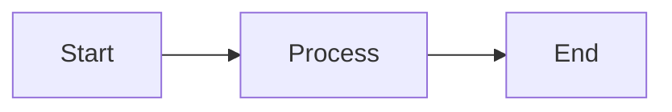

# MirrorDNA Documentation Hub

This repository includes a comprehensive documentation site built with **MkDocs** and the **Material for MkDocs** theme.

## 📚 Documentation Site Structure

The documentation site is located in the `/site/` directory:

```
site/
├── docs/                      # Documentation pages (Markdown)
│   ├── index.md              # Home page
│   ├── ecosystem-overview.md
│   ├── mirrordna-standard.md
│   ├── principles.md
│   ├── compliance-levels.md
│   ├── glossary.md
│   ├── roadmap.md
│   ├── lingos.md
│   ├── activemirroros.md
│   ├── trust-by-design.md
│   ├── agentdna.md
│   ├── glyphtrail.md
│   ├── vault-manager.md
│   ├── vault-integrity.md
│   ├── quickstart.md
│   ├── integration.md
│   ├── examples.md
│   ├── validators.md
│   ├── faq.md
│   ├── architecture.md
│   ├── contributing.md
│   └── why-mirrordna.md
├── mkdocs.yml                # MkDocs configuration
└── requirements.txt          # Python dependencies
```

## 🚀 Quick Start

### Prerequisites

- Python 3.8 or higher
- pip (Python package manager)

### Installation

1. **Navigate to the site directory:**

   ```bash
   cd site
   ```

2. **Install dependencies:**

   ```bash
   pip install -r requirements.txt
   ```

   This installs:
   - `mkdocs==1.5.3` — Static site generator
   - `mkdocs-material==9.5.3` — Material theme
   - `pymdown-extensions==10.7` — Markdown extensions

3. **Verify installation:**

   ```bash
   mkdocs --version
   ```

   You should see output like: `mkdocs, version 1.5.3`

## 🖥️ Local Development

### Serve Locally

Run a local development server with live reload:

```bash
cd site
mkdocs serve
```

**Output:**

```
INFO    -  Building documentation...
INFO    -  Cleaning site directory
INFO    -  Documentation built in 0.52 seconds
INFO    -  [15:30:00] Watching paths for changes: 'docs', 'mkdocs.yml'
INFO    -  [15:30:00] Serving on http://127.0.0.1:8000/
```

**Open in browser:** http://127.0.0.1:8000/

The site will **automatically reload** when you edit any Markdown files.

### Custom Port

To use a different port:

```bash
mkdocs serve -a 127.0.0.1:8080
```

### Strict Mode

To catch warnings as errors during development:

```bash
mkdocs serve --strict
```

## 🏗️ Building the Site

### Build Static Site

Generate static HTML files:

```bash
cd site
mkdocs build
```

**Output location:** `site/site/` (the built HTML)

The generated site is a static website that can be:
- Hosted on any web server
- Deployed to GitHub Pages
- Served from a CDN
- Opened directly in a browser

### Clean Build

To clean the output directory before building:

```bash
mkdocs build --clean
```

### Build with Strict Warnings

```bash
mkdocs build --strict
```

This fails the build if there are any warnings (useful for CI/CD).

## 🚢 Deployment

### Option 1: GitHub Pages (Recommended)

#### Method A: Automatic Deployment with GitHub Actions

1. **Create GitHub Actions workflow:**

   Create `.github/workflows/docs.yml`:

   ```yaml
   name: Deploy Documentation

   on:
     push:
       branches:
         - main
       paths:
         - 'site/**'

   jobs:
     deploy:
       runs-on: ubuntu-latest
       steps:
         - uses: actions/checkout@v4

         - name: Setup Python
           uses: actions/setup-python@v4
           with:
             python-version: 3.x

         - name: Install dependencies
           run: |
             cd site
             pip install -r requirements.txt

         - name: Build and deploy
           run: |
             cd site
             mkdocs gh-deploy --force
   ```

2. **Commit and push:**

   ```bash
   git add .github/workflows/docs.yml
   git commit -m "Add GitHub Pages deployment workflow"
   git push
   ```

3. **Enable GitHub Pages:**

   - Go to repository **Settings** → **Pages**
   - Source: Deploy from a branch
   - Branch: `gh-pages` / `root`
   - Save

4. **Access your site:**

   Your documentation will be available at:
   ```
   https://mirrordna-reflection-protocol.github.io/MirrorDNA-Standard/
   ```

#### Method B: Manual Deployment

1. **Build and deploy:**

   ```bash
   cd site
   mkdocs gh-deploy
   ```

   This command:
   - Builds the documentation
   - Creates/updates the `gh-pages` branch
   - Pushes to GitHub
   - Your site is live!

2. **With a commit message:**

   ```bash
   mkdocs gh-deploy -m "Update documentation to v1.1"
   ```

3. **Force push (if needed):**

   ```bash
   mkdocs gh-deploy --force
   ```

#### Custom Domain (Optional)

1. **Add CNAME file:**

   Create `site/docs/CNAME`:
   ```
   docs.mirrordna.org
   ```

2. **Configure DNS:**

   Add a CNAME record pointing to:
   ```
   mirrordna-reflection-protocol.github.io
   ```

3. **Deploy:**

   ```bash
   mkdocs gh-deploy
   ```

---

### Option 2: Netlify

1. **Create `netlify.toml`:**

   ```toml
   [build]
     base = "site"
     command = "mkdocs build"
     publish = "site"

   [build.environment]
     PYTHON_VERSION = "3.10"
   ```

2. **Connect to Netlify:**

   - Go to https://netlify.com
   - Import your GitHub repository
   - Netlify will auto-detect the configuration
   - Deploy!

---

### Option 3: Vercel

1. **Create `vercel.json`:**

   ```json
   {
     "buildCommand": "cd site && pip install -r requirements.txt && mkdocs build",
     "outputDirectory": "site/site",
     "installCommand": "pip install -r site/requirements.txt"
   }
   ```

2. **Deploy with Vercel CLI:**

   ```bash
   npm i -g vercel
   vercel
   ```

---

### Option 4: Self-Hosted

1. **Build the site:**

   ```bash
   cd site
   mkdocs build
   ```

2. **Copy `site/site/` to your web server:**

   ```bash
   rsync -avz site/site/ user@server:/var/www/docs/
   ```

3. **Configure your web server** (nginx, Apache, etc.) to serve the files.

---

## 📝 Editing Documentation

### File Structure

All documentation pages are in `site/docs/` as Markdown files.

### Navigation

Edit `site/mkdocs.yml` to update the navigation structure:

```yaml
nav:
  - Home: index.md
  - Ecosystem:
      - Overview: ecosystem-overview.md
      - Why MirrorDNA?: why-mirrordna.md
  # Add more sections here
```

### Adding a New Page

1. **Create the Markdown file:**

   ```bash
   touch site/docs/new-page.md
   ```

2. **Add content:**

   ```markdown
   # New Page Title

   Content goes here...
   ```

3. **Update navigation in `mkdocs.yml`:**

   ```yaml
   nav:
     - New Section:
         - New Page: new-page.md
   ```

4. **Test locally:**

   ```bash
   mkdocs serve
   ```

### Material for MkDocs Features

The site uses Material for MkDocs with many extensions:

#### Admonitions

```markdown
!!! note "Optional Title"
    This is a note

!!! tip
    This is a tip

!!! warning
    This is a warning

!!! danger
    This is dangerous!
```

#### Code Blocks with Syntax Highlighting

````markdown
```python
def hello():
    print("Hello, MirrorDNA!")
```
````

#### Tabs

```markdown
=== "Tab 1"

    Content for tab 1

=== "Tab 2"

    Content for tab 2
```

#### Task Lists

```markdown
- [x] Completed task
- [ ] Incomplete task
```

#### Tables

```markdown
| Column 1 | Column 2 |
|----------|----------|
| Data 1   | Data 2   |
```

#### Mermaid Diagrams

````markdown

````

---

## 🔍 Search

The documentation site includes full-text search powered by MkDocs search plugin. It's automatically enabled and works out of the box.

---

## 🎨 Customization

### Theme Colors

Edit `site/mkdocs.yml`:

```yaml
theme:
  palette:
    primary: deep purple
    accent: purple
```

Available colors: red, pink, purple, deep purple, indigo, blue, light blue, cyan, teal, green, light green, lime, yellow, amber, orange, deep orange

### Logo and Favicon

1. **Add images to `site/docs/assets/`:**

   ```bash
   mkdir -p site/docs/assets
   cp logo.png site/docs/assets/
   cp favicon.ico site/docs/assets/
   ```

2. **Update `mkdocs.yml`:**

   ```yaml
   theme:
     logo: assets/logo.png
     favicon: assets/favicon.ico
   ```

---

## 🧪 Testing

### Link Checking

To check for broken links:

```bash
# Build in strict mode
mkdocs build --strict

# This will fail on warnings including broken links
```

### Spell Checking

Consider using a spell checker on your Markdown files:

```bash
# Using aspell
find site/docs -name "*.md" -exec aspell check {} \;
```

---

## 📦 CI/CD Integration

### GitHub Actions Example

See "Option 1: GitHub Pages" above for a complete workflow.

### GitLab CI

```yaml
pages:
  stage: deploy
  image: python:3.10
  script:
    - cd site
    - pip install -r requirements.txt
    - mkdocs build --strict
    - mv site ../public
  artifacts:
    paths:
      - public
  only:
    - main
```

---

## 🐛 Troubleshooting

### Issue: `mkdocs: command not found`

**Solution:** Make sure MkDocs is installed:

```bash
pip install mkdocs
```

### Issue: Theme not found

**Solution:** Install Material theme:

```bash
pip install mkdocs-material
```

### Issue: Port already in use

**Solution:** Use a different port:

```bash
mkdocs serve -a 127.0.0.1:8080
```

### Issue: Build fails with warnings

**Solution:** Check for:
- Broken internal links
- Missing referenced files
- Invalid YAML in front matter

Run in verbose mode:

```bash
mkdocs build --verbose
```

---

## 📚 Additional Resources

- **MkDocs Documentation:** https://www.mkdocs.org/
- **Material for MkDocs:** https://squidfunk.github.io/mkdocs-material/
- **PyMdown Extensions:** https://facelessuser.github.io/pymdown-extensions/
- **Markdown Guide:** https://www.markdownguide.org/

---

## 🤝 Contributing to Documentation

See [Contributing Guide](site/docs/contributing.md) for detailed instructions on:

- How to propose documentation changes
- Style guidelines
- Commit message format
- Pull request process

**Quick contribution workflow:**

1. Fork the repository
2. Create a feature branch: `git checkout -b docs/improve-quickstart`
3. Edit documentation in `site/docs/`
4. Test locally: `mkdocs serve`
5. Commit: `git commit -m "docs: improve quickstart guide"`
6. Push and create a pull request

---

## 📄 License

The documentation is part of the MirrorDNA-Standard repository and follows the same MIT License.

---

⟡⟦DOCUMENTATION⟧ · ⟡⟦MKDOCS⟧ · ⟡⟦MATERIAL⟧

*Comprehensive documentation for the MirrorDNA ecosystem*
