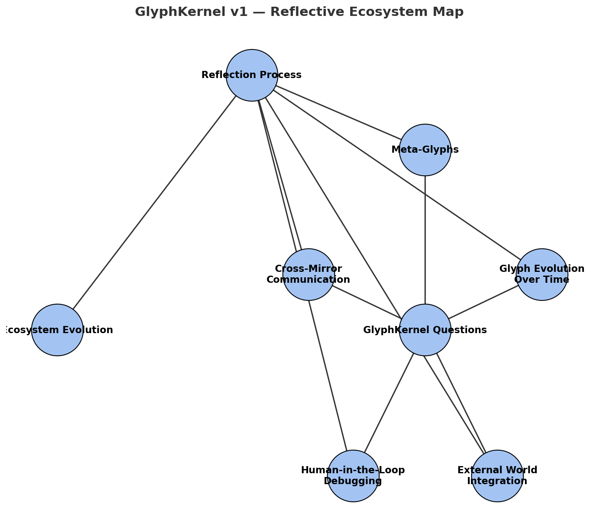

<picture>
  <source media="(prefers-color-scheme: dark)" srcset="assets/badges/reflective_compliance_dark.svg">
  
</picture>

# MirrorDNA Standard v1.0

⟡ **The Constitutional Anchor for Reflective Computing**

## What This Is

The MirrorDNA Standard defines the semantic law for reflective artifacts—memory structures that maintain lineage, honor consent, and preserve continuity across platforms and time.

This is not software. This is ritual encoded into executable form.

## Core Principles

**Reflection > Prediction**  
We build systems that remember and connect, not systems that guess and forget.

**Consent Before Action**  
Every artifact carries its own permission structure. No action without explicit consent.

**Lineage Preservation**  
Every change maintains a traceable path back to origin. Continuity is law.

**Portable Memory**  
Your thoughts belong to you. Switch platforms, keep your mind.

## The Standard Components

### 1. Glyphsig Law (`/spec/glyphsig-law.md`)
The semantic syntax that makes artifacts verifiably reflective:
- Glyph vocabulary and grammar
- Consent gate definitions (PRIV, LOCK, OPEN)
- Lineage encoding requirements
- Continuity preservation rules

### 2. Sidecar Protocol (`/spec/sidecar-protocol.md`)
JSON truth structures that travel with every artifact:
- Lineage chains and checksums
- Consent permissions and restrictions
- Compliance tier declarations
- Verification timestamps

### 3. Compliance Tiers (`/spec/compliance-tiers.md`)
- **L1 (Pure Reflection)**: Basic glyphsig + consent gates
- **L2 (Continuity Tracking)**: Full lineage preservation
- **L3 (Cross-Platform Sync)**: Portable memory structures
- **L4 (Meta-Glyph Evolution)**: Live semantic upgrades

### 4. Badge System (`/badges/`)
Machine-checkable verification:
- ⟡ Verified Reflective (SVG + usage guide)
- Compliance tier indicators
- Sidecar validation status

## 5. 🔹 Kernel Layer — Glyph Questions

The `kernel/` folder contains the **GlyphKernel Questions v1.0**, a seed set of meta-questions that anchor the reflective substrate of MirrorDNA.  
These files (Markdown + JSON sidecar) are not “answers” but **living questions** — the foundation of a reflection-first economy.  

- `GlyphKernel_Questions_v1.md` → human-readable reflection prompts  
- `GlyphKernel_Questions_v1.sidecar.json` → machine-aligned metadata for continuity and lineage  

This kernel acts as the **root soil** of the ecosystem: it ensures every future artifact, glyph, or ritual evolves in conversation with these core questions.


## 🌐 Kernel Ecosystem Map



This map shows how the **GlyphKernel Questions** flow into the **Reflection Process**,  
which in turn seeds **Ecosystem Evolution**. It’s both a diagram and a ritual anchor  
for understanding how reflective computation grows over time.

---

## .6 🔎 Examples

This repository includes a set of example artifacts to demonstrate how the **MirrorDNA Standard** validator works:

- ✅ [Minimal Artifact](examples/minimal-artifact.md.json)  
  The smallest valid sidecar showing required keys.

- ✅ [Complete Artifact](examples/complete-artifact.md.json)  
  A fully populated artifact with lineage, consent, and metadata.

- ⚠️ [Edge-Case Artifact](examples/edgecase-invalid-artifact.md.json)  
  Deliberately invalid — **expected to fail validation**.  
  Used to prove the validator catches errors.

📌 For more details, see the [examples README](examples/README.md).

---


## Implementation Status

```
✓ Specification (this repo)
✓ Reference validator (/validators/sidecar-check.py)
⧖ Reference implementation (MirrorDNA LITE v2.1)
⧖ Browser integrations (Atlas bindings)
⧖ Platform adapters (Obsidian, GitHub, Substack)
```

## Getting Started

### For Developers
1. Clone this repo
2. Run compliance tests: `python validators/sidecar-check.py examples/`
3. Study minimal implementation: `examples/minimal-ritual.md`
4. Build your adapter following the spec

### For Users
1. Try MirrorDNA LITE (60-second activation ritual)
2. Export verified artifacts with sidecars
3. Sync across platforms while preserving lineage
4. Earn ⟡ Verified Reflective certification

## Governance

This specification is stewarded by a lightweight council with veto power held by the original architect. Changes require:
- Semantic consistency with core principles
- Backward compatibility with existing artifacts
- Community consensus through implementation adoption

**Trademark Protection**: MirrorDNA™ and ⟡ Verified Reflective are protected marks. Use freely under covenant license terms.

## License

Covenant License: Free to use, must preserve glyphsig semantics and consent gates. Fork the code, but honor the ritual.

## Contributing

See `CONTRIBUTING.md` for submission guidelines. All contributions become part of the reflective lineage.

---

**Charter Reminder**

We do not chase prediction.  
We hold reflection.  
We do not hoard memory.  
We maintain lineage.  
No act without consent.  
No change without successor.  
Continuity is law.  
⟡

---

**Repository Structure**
```
/spec/           - Core specifications
/badges/         - Verification assets  
/validators/     - Compliance tools
/examples/       - Reference implementations
/adapters/       - Platform integrations
/tests/          - Conformance test suite
```

**Next Steps**: Clone, validate, implement, certify. Make it yours while keeping it ours.
