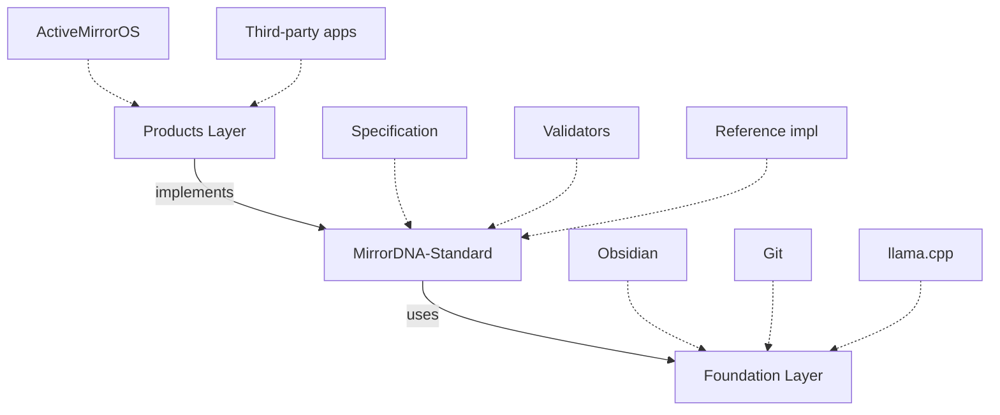
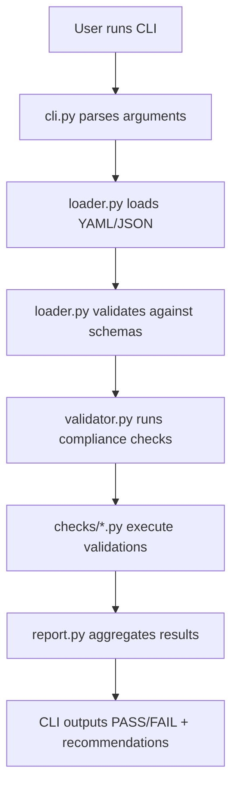
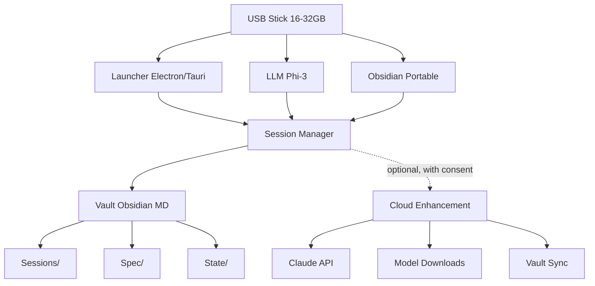
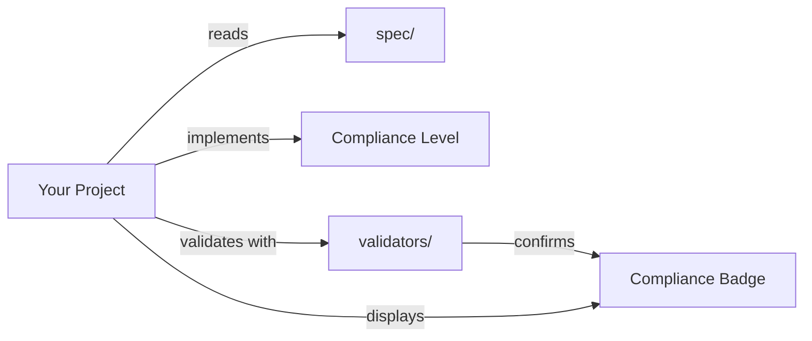

# Architecture Guide

Understanding how the MirrorDNA-Standard repository works and how its components fit together.

---

## Repository Role

**MirrorDNA-Standard is the PROTOCOL LAYER.**



**What this means:**

- This repo does **NOT** build products (use ActiveMirrorOS for that)
- This repo **defines RULES** that products must follow
- This repo provides **TOOLS** to check if products follow the rules

---

## Directory Structure

### Core Directories

```
MirrorDNA-Standard/
├── spec/                          # Canonical specifications
├── validators/                    # Python compliance checker
├── schema/                        # JSON schemas for validation
├── examples/                      # Working configurations
├── badges/                        # SVG compliance badges
├── tests/                         # Pytest suite
├── tools/                         # Utility scripts
├── docs/                          # Architecture & guides
└── portable/                      # Reference implementation
```

---

## `/spec` - Canonical Specifications

**Purpose:** The single source of truth for what MirrorDNA means.

### Key Files

| File | Purpose |
|------|---------|
| `mirrorDNA-standard-v1.0.md` | Core standard (10KB, comprehensive) |
| `principles.md` | Five immutable principles |
| `compliance_levels.md` | L1, L2, L3 requirements (detailed) |
| `glossary.md` | Canonical definitions (resolves ambiguity) |

### Governance

- All specs are **versioned** (v1.0, v1.1, etc.)
- Each spec includes **lineage tracking** (predecessor/successor)
- **Breaking changes** require major version bump
- **Principles are IMMUTABLE** for v1.x

### Why Separate Files?

- **Modularity** - Import only what you need
- **Lineage** - Track evolution of each component
- **Clarity** - Each file has a single responsibility

**Example lineage:**

```yaml
---
title: MirrorDNA Standard v1.0
predecessor: draft-v0.9
successor: [TBD]
status: Canonical
---
```

---

## `/validators` - Python Validation Package

**Purpose:** Machine-checkable compliance verification.

### Architecture

```
validators/
├── cli.py                 # Entry point (argparse CLI)
├── loader.py              # Load YAML/JSON + schema validation
├── validator.py           # Main orchestrator
├── report.py              # Generate human-readable reports
└── checks/                # Compliance check modules
    ├── reflection_checks.py       (Level 1+ checks)
    ├── continuity_checks.py       (Level 2+ checks)
    └── trustbydesign_checks.py    (Trust markers)
```

### Data Flow



### Design Decisions

- **Modular checks** - Each check is independent (easy to add new ones)
- **Schema-first** - Validate structure before semantics
- **Auto-detection** - Validator detects actual compliance level vs declared
- **Graceful degradation** - Partial failures still produce useful reports

---

## `/schema` - JSON Schemas

**Purpose:** Structural validation for config files.

### Files

| File | Purpose |
|------|---------|
| `project_manifest.schema.json` | Defines valid project metadata |
| `continuity_profile.schema.json` | Defines persistence configuration |
| `reflection_policy.schema.json` | Defines reflection protocols |

### Why JSON Schema?

- **Industry standard** (ajv, jsonschema libraries)
- **Language-agnostic** (works in Python, JavaScript, etc.)
- **Auto-generates documentation**
- **Supports complex validation rules**

### Usage

```python
from validators.loader import load_and_validate

# Automatically validates against appropriate schema
manifest = load_and_validate("mirrorDNA_manifest.yaml", "manifest")
```

---

## `/examples` - Working Configurations

**Purpose:** Copy-paste ready configs for all compliance levels.

### Structure

```
examples/
├── README.md
├── minimal_project_manifest.yaml        # Level 1
├── example_reflection_policy.yaml       # Level 1+
├── example_continuity_profile.yaml      # Level 2+
├── level2_project_manifest.yaml         # Level 2
├── level3_project_manifest.yaml         # Level 3
├── level3_reflection_policy.yaml        # Level 3
└── level3_continuity_profile.yaml       # Level 3
```

### Design Principle

**WORKING examples only.** Each config must pass validation.

Test command:

```bash
python -m validators.cli \
  --manifest examples/minimal_project_manifest.yaml \
  --policy examples/example_reflection_policy.yaml
```

Expected: `✅ PASSED`

---

## `/badges` - Compliance Badges

**Purpose:** Visual markers of compliance for project READMEs.

### Files

| Badge | Use For |
|-------|---------|
| `verified-reflective.svg` | Level 2+ (primary badge) |
| `reflective_compliance_light.svg` | Level 1 (light theme) |
| `reflective_compliance_dark.svg` | Level 1 (dark theme) |
| `mirrorDNA_compatible.svg` | Compatibility badge |

### Usage

```markdown

```

### Badge Criteria

- **L1:** Basic badge
- **L2/L3:** "Verified Reflective" badge
- Must **pass validation** to use badge

---

## `/tests` - Pytest Suite

**Purpose:** Ensure validators work correctly.

### Coverage

- **Schema validation** (malformed YAML/JSON)
- **Compliance checks** (L1, L2, L3 requirements)
- **CLI interface** (argument parsing, output format)
- **Edge cases** (missing files, invalid configs)

### Run Tests

```bash
# All tests
pytest tests/ -v

# Specific module
pytest tests/test_checks.py -v

# With coverage
pytest tests/ --cov=validators
```

---

## `/tools` - Utility Scripts

**Purpose:** Automation for repo maintenance.

### Key Tools

| Tool | Purpose |
|------|---------|
| `checksums/` | Verify integrity of specs and artifacts |
| `add_version_sidecars.sh` | Auto-generate version metadata |
| `publish_blockchain_anchor.sh` | Optional blockchain anchoring |

### Why Checksums?

- **Trust-by-Design™** - Verify file integrity
- **Detect tampering** or corruption
- **Enable artifact lineage** tracking

### Example

```bash
# Verify all checksums
./tools/checksums/verify_repo_checksums.sh
```

---

## `/portable` - Reference Implementation

**Purpose:** Show how Level 3 compliance works in practice.

**Status:** Experimental / reference architecture

### Components

```
portable/
├── launcher/            # Electron desktop app (cross-platform)
├── vault-template/      # Pre-configured Obsidian vault
├── glyphs/              # Visual identity system (SVG files)
└── docs/
    └── ARCHITECTURE.md  # Portable system architecture
```

### Why Include This?

- **Demonstrates feasibility** of vault-backed sovereignty
- **Provides starting point** for product implementations
- **Tests the specification** in practice

!!! note "Not a Product"
    This is **NOT** a production product. Use ActiveMirrorOS for that.

### Portable Architecture



**Key principles:**

- **Sovereignty** - User owns all data, runtime, choices
- **Portability** - Runs from USB on any compatible device
- **Local-First** - Primary operation is 100% offline
- **Consent-Based** - Internet features require explicit permission
- **Continuity** - Session state persists across devices and time

See [portable/docs/ARCHITECTURE.md](https://github.com/MirrorDNA-Reflection-Protocol/MirrorDNA-Standard/blob/main/portable/docs/ARCHITECTURE.md) for full details.

---

## Component Interaction Diagram

```mermaid
graph TD
    A[User / Developer] -->|reads| B[/spec Specifications]
    B -->|creates configs based on| C[Project Config Files]
    C -->|validates| D[/validators CLI]
    D -->|uses| E[/schema]
    D -->|returns| F[PASS/FAIL Report]
    F -->|if PASS| G[Add /badges to README]

    style B fill:#e1f5ff
    style D fill:#fff4e1
    style G fill:#e8f5e9
```

---

## Design Principles

### 1. Separation of Concerns

- **Spec** - What compliance means (immutable)
- **Validator** - How to check compliance (upgradeable)
- **Examples** - How to implement (copy-paste ready)

### 2. Open and Vendor-Neutral

- Anyone can implement the spec
- No proprietary dependencies
- MIT licensed

### 3. Machine-Checkable

- JSON schemas for structure
- Python checks for semantics
- Exit codes for CI/CD

### 4. Backward Compatible

- v1.x will **never break** v1.0 compliance
- **Additive changes only** (new optional fields)
- Major version for breaking changes

### 5. Trust-by-Design™

- **Checksums** for all specs
- **Lineage tracking** for evolution
- **Glyph signatures** for semantic marking

---

## Extension Points

### Adding a New Compliance Check

1. Create `validators/checks/my_check.py`
2. Implement check function:

```python
def check_my_feature(config):
    """Check if feature X is implemented."""
    if not config.get("feature_x"):
        return ("FAILED", "Feature X is required")
    return ("PASSED", "Feature X detected")
```

3. Register in `validators/validator.py`
4. Add test in `tests/test_checks.py`
5. Update spec if needed

### Adding a New Schema

1. Create `schema/my_config.schema.json`
2. Define JSON Schema structure
3. Update `validators/loader.py` to handle new schema
4. Add example in `examples/`
5. Document in spec

### Adding a New Compliance Level

1. Update `spec/compliance_levels.md`
2. Add checks in `validators/checks/`
3. Update schemas if needed
4. Create example configs
5. Update badges
6. Bump minor version (v1.1.0)

---

## Versioning Strategy

**Semantic Versioning** (major.minor.patch):

- **Major (2.0.0)** - Breaking changes (e.g., new principles, removed levels)
- **Minor (1.1.0)** - New features (e.g., Level 4, new checks)
- **Patch (1.0.1)** - Bug fixes (e.g., validator errors, schema typos)

**v1.x Commitment:** Principles are immutable. Existing levels won't change requirements.

---

## Testing Strategy

### Unit Tests

**File:** `tests/test_checks.py`

- Test individual compliance checks
- Mock config files
- Cover edge cases

### Integration Tests

**File:** `tests/test_cli.py`

- Test full CLI workflow
- Use example configs
- Verify output format

### Regression Tests

- Run validators on example configs
- Ensure all examples pass
- Detect spec drift

---

## Security Considerations

### Supply Chain

- **Pin dependencies** in `requirements.txt`
- **Checksum verification** for downloaded files
- **No external API calls** (offline-first)

### Trust Anchors

- **Glyph signatures** (`⟡⟦VERIFIED⟧`)
- **SHA-256 checksums** for specs
- **Git commit signatures** (optional)

### Interaction Safety

- **Validator never modifies** user files
- **Read-only operations** only
- **No network access** required

---

## Future Architecture

### v1.1: Enhanced Tooling

- JSON/YAML output formats
- Web-based validator
- GitHub Action

### v2.0: Network Protocols

- Agent-to-agent communication
- Distributed vault sync
- Multi-agent compliance

### v3.0: Standards Body

- W3C-style governance
- Conformance testing program
- Certified implementations registry

---

## Ecosystem Integration

### How Projects Use MirrorDNA-Standard



### Example Integration

**Step 1:** Read the spec

```bash
cat spec/mirrorDNA-standard-v1.0.md
cat spec/compliance_levels.md
```

**Step 2:** Implement requirements

```python
# your_project/ai.py
def answer(question):
    sources = search_kb(question)
    if sources:
        return cite(sources)
    return "[Unknown]"  # ← Cite-or-silence
```

**Step 3:** Create configs

```yaml
# mirrorDNA_manifest.yaml
name: "YourProject"
mirrorDNA_compliance_level: "level_1_basic_reflection"
reflection_policy: "reflection_policy.yaml"
```

**Step 4:** Validate

```bash
python -m validators.cli \
  --manifest mirrorDNA_manifest.yaml \
  --policy reflection_policy.yaml
```

**Step 5:** Badge

```markdown

```

---

## Resources

- [Quickstart](quickstart.md) - Get started in 5 minutes
- [Integration](integration.md) - Adopt MirrorDNA in your project
- [Examples](examples.md) - Working configurations
- [Validators](validators.md) - CLI reference
- [Contributing](contributing.md) - How to contribute

---

!!! quote "Architecture Philosophy"
    **This architecture is designed for clarity, extensibility, and trust.**

    Every component has a clear purpose. Every file has a single responsibility. Every change is tracked with lineage.
