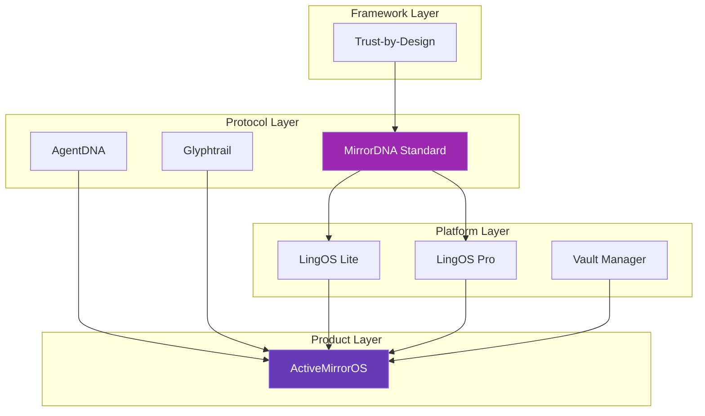

# Ecosystem Overview

The MirrorDNA ecosystem is a constellation of protocols, platforms, and products that work together to enable reflective AI computing.

## Architecture Layers

The ecosystem is organized into four distinct layers:



## Layer 1: Protocol Layer

### MirrorDNA Standard

**Role:** Constitutional specification for reflective AI

The core protocol that defines:

- Three compliance levels (L1, L2, L3)
- Five immutable principles
- Anti-hallucination protocol (Cite or Silence)
- Continuity requirements
- Validation schemas

**Repository:** This repo — MirrorDNA-Standard

**Status:** Open specification, v1.0.0 production-ready

[:octicons-arrow-right-24: View the standard](mirrordna-standard.md)

---

### AgentDNA

**Role:** Agent identity and capability registry

AgentDNA provides:

- Unique agent identifiers tied to vaults
- Capability declarations and versioning
- Agent lineage tracking
- Trust attestations

**Key Features:**

- Agents declare what they can do (capabilities)
- Version tracking for capability evolution
- No "expert review" claims (security fix in v1.1)
- Machine-readable capability schemas

**Specification:** `spec/MirrorDNA_Capability_Registry_v1.1.md`

[:octicons-arrow-right-24: Learn about AgentDNA](agentdna.md)

---

### Glyphtrail

**Role:** Symbolic lineage and audit trail

Glyphtrail tracks:

- Predecessor/successor chains
- Glyph signature evolution
- Semantic markers across time
- Tamper-evident audit trails

**Key Concepts:**

- **Glyphs:** Symbolic markers like `⟡⟦CONTINUITY⟧`
- **Trails:** Verifiable chains of artifacts
- **Checksums:** SHA-256 integrity validation
- **Lineage:** Who → What → When

[:octicons-arrow-right-24: Explore Glyphtrail](glyphtrail.md)

---

## Layer 2: Platform Layer

### LingOS (Language Operating System)

**Role:** Language-native interface for reflective computing

LingOS provides the symbolic and linguistic layer that sits between users and reflective AI systems.

#### LingOS Lite

- Minimal symbolic processing
- Glyph rendering and validation
- Basic continuity primitives
- Suitable for Level 1 & 2 compliance

#### LingOS Pro

- Advanced glyph kernel
- Multi-vault orchestration
- Symbolic computation engine
- Required for Level 3 compliance

**Key Features:**

- Glyph-based command language
- Vault-native file operations
- Session boundary management
- Reflection chain visualization

[:octicons-arrow-right-24: Dive into LingOS](lingos.md)

---

### Vault Manager

**Role:** Vault orchestration and integrity

Vault Manager handles:

- Vault creation and initialization
- Integrity verification (checksums)
- Snapshot management
- Cross-device synchronization

**Vault Types Supported:**

- Obsidian vaults (recommended)
- Custom vaults (file-system based)
- Distributed vaults (experimental)
- Cloud-backed vaults (with encryption)

**Key Operations:**

```yaml
# Vault manifest example
vault_id: "AMOS://User/MyVault/v1.0"
vault_type: "obsidian"
continuity_mechanism: "vault_backed"
integrity_check: "sha256"
```

[:octicons-arrow-right-24: Vault Manager details](vault-manager.md)

---

## Layer 3: Product Layer

### ActiveMirrorOS™

**Role:** Canonical Level 3 implementation

ActiveMirrorOS is the commercial product that fully implements MirrorDNA Level 3 compliance.

**What It Provides:**

- **Sovereign AI:** User owns vault and identity
- **Desktop application:** Electron-based launcher
- **Local LLM integration:** Offline-capable
- **Full compliance:** Level 3 certified
- **Production-ready:** Commercial support available

**Components:**

- Vault-backed session management
- Integrated LingOS Pro
- AgentDNA capability registry
- Glyphtrail audit logging
- Trust-by-Design governance

**Status:**

- Early access available
- Public beta coming Q2 2025
- Full release Q3 2025

[:octicons-arrow-right-24: Explore ActiveMirrorOS](activemirroros.md)

---

## Layer 4: Framework Layer

### Trust-by-Design™

**Role:** Governance and organizational framework

Trust-by-Design extends MirrorDNA principles into organizational governance:

**Key Principles:**

1. **Verification First:** Security built in, not bolted on
2. **Transparency:** All decisions traceable
3. **Auditability:** Compliance reporting
4. **Sovereignty:** User control preserved
5. **Accountability:** Clear responsibility chains

**Applications:**

- Enterprise AI governance
- Regulatory compliance (EU AI Act, etc.)
- Institutional AI adoption
- Multi-stakeholder systems

[:octicons-arrow-right-24: Trust by Design framework](trust-by-design.md)

---

## How the Layers Work Together

### Example: A User Session

1. **User** opens ActiveMirrorOS (Product Layer)
2. **ActiveMirrorOS** loads vault via Vault Manager (Platform Layer)
3. **Vault Manager** verifies checksums using Glyphtrail (Protocol Layer)
4. **LingOS** renders glyphs and manages session (Platform Layer)
5. **AgentDNA** registers agent capabilities (Protocol Layer)
6. **MirrorDNA Standard** validates compliance (Protocol Layer)
7. **Trust-by-Design** ensures governance (Framework Layer)

All layers honor the same constitutional anchor: **MirrorDNA Standard v1.0**

---

## Open vs. Proprietary

The ecosystem balances open protocols with sustainable products:

| Component | Status | License |
|-----------|--------|---------|
| MirrorDNA Standard | Open | MIT |
| AgentDNA | Open | MIT |
| Glyphtrail | Open | MIT |
| LingOS Lite | Open | MIT |
| LingOS Pro | Commercial | Proprietary |
| Vault Manager | Open | MIT |
| ActiveMirrorOS | Commercial | Proprietary |
| Trust-by-Design | Framework | CC BY-SA 4.0 |

**Philosophy:**

- Protocols are open (anyone can implement)
- Products may be commercial (sustainable business)
- Standards remain vendor-neutral

---

## Ecosystem Maturity

| Component | Status | Version |
|-----------|--------|---------|
| MirrorDNA Standard | ✅ Production | v1.0.0 |
| AgentDNA | ✅ Production | v1.1.0 |
| Glyphtrail | 🚧 Beta | v0.9.0 |
| LingOS Lite | 🚧 Beta | v0.8.0 |
| LingOS Pro | 🔬 Alpha | v0.5.0 |
| Vault Manager | ✅ Production | v1.0.0 |
| ActiveMirrorOS | 🔬 Alpha | v0.7.2 |
| Trust-by-Design | 📖 Conceptual | v1.0.0 |

Legend:
- ✅ Production — Stable and ready
- 🚧 Beta — Functional, stabilizing
- 🔬 Alpha — Early development
- 📖 Conceptual — Framework/guidelines

---

## Roadmap

### Q1 2025 (Current)

- ✅ MirrorDNA Standard v1.0 released
- 🚧 Validator tooling improvements
- 🚧 Documentation hub (this site)

### Q2 2025

- LingOS Lite v1.0 stable
- ActiveMirrorOS public beta
- Validator web interface
- GitHub Action for CI/CD

### Q3 2025

- ActiveMirrorOS production release
- LingOS Pro v1.0
- Multi-vault orchestration
- Enterprise Trust-by-Design toolkit

### Q4 2025+

- Network protocols (agent-to-agent)
- Level 4 compliance (multi-vault)
- Blockchain anchoring (optional)
- W3C standardization track

[:octicons-arrow-right-24: Full roadmap](roadmap.md)

---

## Related Projects

Beyond the core ecosystem, several community projects are emerging:

- **MirrorDNA Stress Harness:** Load testing for reflective systems
- **Vault Templates:** Community vault configurations
- **Integration Examples:** Langchain, LlamaIndex, etc.
- **Research Implementations:** Academic case studies

---

⟡⟦ECOSYSTEM⟧ · ⟡⟦ARCHITECTURE⟧ · ⟡⟦LAYERS⟧

*The complete MirrorDNA constellation — from protocol to product*
