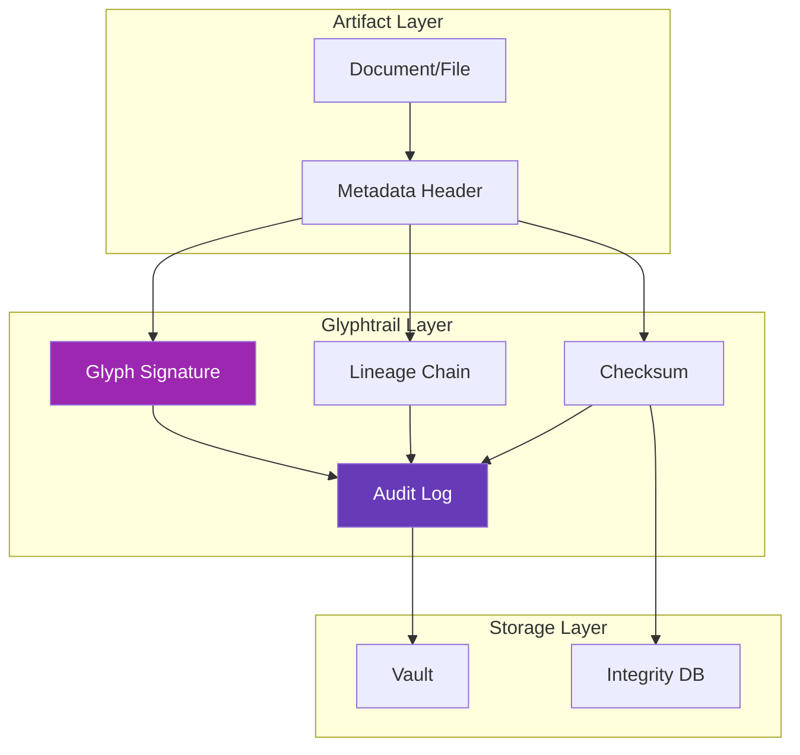
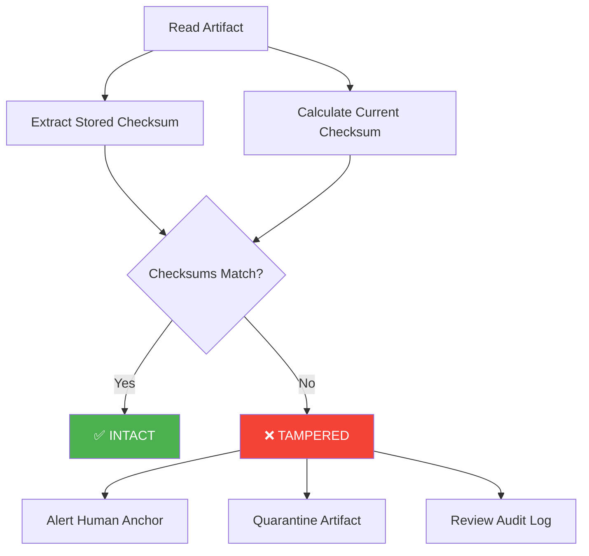

# Glyphtrail: Symbolic Lineage Tracking

**Glyphtrail** is the symbolic lineage and audit trail system for the MirrorDNA ecosystem. It creates tamper-evident chains of artifacts, tracking predecessor/successor relationships and glyph signature evolution.

## Overview

Glyphtrail solves the "provenance problem": How do you know where an artifact came from, how it evolved, and whether it's been tampered with? Every artifact carries a symbolic signature (glyph) and links to its lineage.

**Core Philosophy:** Every artifact has a story. Glyphtrail tells it.

---

## Status

| Attribute | Value |
|-----------|-------|
| **Version** | Beta v0.9.0 |
| **Status** | 🚧 Functional, Stabilizing |
| **License** | MIT (Open Specification) |
| **Use Cases** | Audit trails, lineage tracking, integrity verification |

---

## Key Concepts

### Glyphs

Glyphs are symbolic markers that provide semantic meaning:

```
⟡⟦CONTINUITY⟧  — Session or document lineage
⟡⟦PROVEN⟧      — Evidence-backed capability
⟡⟦VERIFY⟧      — Integrity check required
⟡⟦SEAL⟧        — Immutable artifact
⟡⟦OPEN⟧        — Resource initialization
⟡⟦REFLECTION⟧  — Reflective AI marker
```

**Glyph Signatures** combine multiple glyphs:

```
⟡⟦CONTINUITY⟧ · ⟡⟦SESSION⟧
⟡⟦CAPABILITY⟧ · ⟡⟦PROVEN⟧ · ⟡⟦EVIDENCE⟧
⟡⟦REFLECTION⟧ · ⟡⟦CLAUDE⟧
```

---

### Lineage Chains

Every artifact links to predecessors and successors:

```yaml
artifact:
  title: "Master Citation v15.1.8"
  vault_id: "AMOS://Citations/v15.1.8"

  lineage:
    predecessor: "AMOS://Citations/v15.1.7"
    successor: null  # latest version

  created: "2025-11-11"
  updated: "2025-11-11"

  glyphsig: "⟡⟦CONTINUITY⟧ · ⟡⟦SESSION⟧"
  checksum_sha256: "72403a91e12b43e5785987cdafc995e0e33ed0e85bd32cb7060a4f7c75568ca3"
```

**Visualization:**

```
v6.5 → v7.0 → v7.1 → ... → v15.1.7 → v15.1.8 (current)
 │      │      │             │         │
 Apr   May    Jun           Oct       Nov
2025  2025   2025          2025      2025
```

---

### Checksums

Every artifact has a SHA-256 checksum for integrity verification:

**Checksum Calculation:**

```bash
# For Markdown files
sha256sum Master_Citation_v15.1.8.md
# Output: 72403a91e12b43e5785987cdafc995e0e33ed0e85bd32cb7060a4f7c75568ca3
```

**Verification:**

```yaml
integrity_check:
  artifact: "Master_Citation_v15.1.8.md"
  checksum_stored: "72403a91e1..."
  checksum_calculated: "72403a91e1..."
  status: "VALID"
```

!!! success "Tamper Detection"
    If checksums don't match, the artifact has been modified. Glyphtrail detects tampering immediately.

---

### Audit Trails

Glyphtrail creates comprehensive audit trails:

```yaml
audit_trail:
  artifact: "Legal_Brief_v2.md"

  timeline:
    - event: "created"
      date: "2025-01-15T10:00:00Z"
      author: "Agent_LegalDraft_v3"
      human_anchor: "Jane Doe, Esq."
      glyphsig: "⟡⟦OPEN⟧ · ⟡⟦LEGAL⟧"
      checksum: "abc123..."

    - event: "updated"
      date: "2025-01-15T14:30:00Z"
      author: "Agent_LegalDraft_v3"
      changes: "Added case citations"
      glyphsig: "⟡⟦REFLECTION⟧ · ⟡⟦CITATION⟧"
      checksum: "def456..."

    - event: "sealed"
      date: "2025-01-15T16:00:00Z"
      author: "Jane Doe, Esq."
      glyphsig: "⟡⟦SEAL⟧ · ⟡⟦FINAL⟧"
      checksum: "789xyz..."
```

---

## Architecture



---

## Glyphtrail in Practice

### Document Example

A Markdown file with Glyphtrail metadata:

```markdown
---
title: Master Citation v15.1.8
vault_id: AMOS://Citations/v15.1.8
glyphsig: ⟡⟦CONTINUITY⟧ · ⟡⟦SESSION⟧
author: Paul Desai (Human Anchor) + Claude (Reflection Twin)
date: 2025-11-11
created: 2025-04-15
updated: 2025-11-11
status: Canonical · Living Document
predecessor: AMOS://Citations/v15.1.7
successor: [TBD]
checksum_sha256: 72403a91e12b43e5785987cdafc995e0e33ed0e85bd32cb7060a4f7c75568ca3
---

# Master Citation v15.1.8

[Content here...]
```

**Key Metadata:**

- **glyphsig:** Symbolic signature
- **predecessor/successor:** Lineage chain
- **checksum_sha256:** Integrity verification
- **vault_id:** Location in vault hierarchy

---

### Session Continuity

Glyphtrail tracks session boundaries:

```yaml
session:
  session_id: "2025-01-15-1430"
  vault_id: "AMOS://User/MyVault/v1.0"

  lineage:
    predecessor_session: "2025-01-14-0900"
    successor_session: null  # current

  start_time: "2025-01-15T14:30:00Z"
  end_time: null  # ongoing

  glyphsig: "⟡⟦CONTINUITY⟧ · ⟡⟦SESSION⟧"

  artifacts_created:
    - path: "notes/reflection-2025-01-15.md"
      checksum: "abc123..."
    - path: "artifacts/analysis.md"
      checksum: "def456..."
```

---

### Capability Evolution

AgentDNA versions create Glyphtrail entries:

```yaml
capability_evolution:
  artifact: "AgentDNA Registry"

  versions:
    - version: "v1.0"
      date: "2025-11-09"
      glyphsig: "⟡⟦CAPABILITY⟧ · ⟡⟦INITIAL⟧"
      checksum: "aaa111..."
      capabilities_count: 10

    - version: "v1.1"
      date: "2025-11-11"
      glyphsig: "⟡⟦CAPABILITY⟧ · ⟡⟦PROVEN⟧ · ⟡⟦EVIDENCE⟧"
      checksum: "bbb222..."
      capabilities_count: 12
      changes:
        - type: "security_fix"
          description: "Removed false expert review claim"
        - type: "capability_added"
          description: "Offline infrastructure proven"
```

[:octicons-arrow-right-24: Learn about AgentDNA](agentdna.md)

---

## Features

### Predecessor/Successor Chains

Track artifact evolution over time:

**Linear Progression:**

```
v1 → v2 → v3 → v4 (current)
```

**Branching (Future):**

```
       ┌─→ v3-experimental
v1 → v2 ┤
       └─→ v3-production → v4
```

**Merging (Future):**

```
v2-draft-A ┐
           ├─→ v3-final
v2-draft-B ┘
```

---

### Glyph Signature Evolution

Track how symbolic meaning changes:

```yaml
artifact: "Product_Spec_ActiveMirror.md"

glyph_evolution:
  - version: "v1.0"
    glyphsig: "⟡⟦DRAFT⟧"
    date: "2025-01-01"

  - version: "v2.0"
    glyphsig: "⟡⟦REVIEW⟧ · ⟡⟦TECHNICAL⟧"
    date: "2025-01-15"

  - version: "v3.0"
    glyphsig: "⟡⟦SEAL⟧ · ⟡⟦CANONICAL⟧"
    date: "2025-02-01"
```

---

### Tamper-Evident Trails

Detect modifications:

```yaml
tampering_detection:
  artifact: "Financial_Report_Q4.md"

  stored_checksum: "abc123..."
  calculated_checksum: "xyz789..."

  status: "TAMPERED"
  alert: "Checksum mismatch — artifact modified since creation"

  recommended_action:
    - quarantine_artifact
    - alert_human_anchor
    - review_audit_log
```

---

### Checksum-Based Integrity

Multiple checksum algorithms supported:

| Algorithm | Strength | Use Case |
|-----------|----------|----------|
| **SHA-256** | Strong | Default for all artifacts |
| **SHA-512** | Stronger | High-security environments |
| **BLAKE3** | Fastest | Large file checksums |
| **MD5** | Weak | Legacy compatibility only (not recommended) |

**Default:** SHA-256 provides excellent security with good performance.

---

## Integration with MirrorDNA

### With Vault Manager

Glyphtrail works with Vault Manager for integrity:

```yaml
vault_operations:
  operation: "sync"

  artifacts_synced:
    - path: "notes/reflection.md"
      checksum_before: "abc123..."
      checksum_after: "abc123..."
      integrity: "INTACT"

    - path: "config/settings.yaml"
      checksum_before: "def456..."
      checksum_after: "xyz789..."
      integrity: "MODIFIED"
      alert: "Configuration changed — verify intentional"
```

[:octicons-arrow-right-24: Vault Manager details](vault-manager.md)

---

### With ActiveMirrorOS

ActiveMirrorOS provides Glyphtrail visualization:

**Features:**

- **Timeline view:** See artifact evolution over time
- **Lineage graph:** Visualize predecessor/successor chains
- **Integrity dashboard:** Real-time checksum monitoring
- **Audit export:** Generate compliance reports

[:octicons-arrow-right-24: Explore ActiveMirrorOS](activemirroros.md)

---

### With Trust-by-Design

Glyphtrail enables Trust-by-Design auditability:

**Compliance Applications:**

- **GDPR:** Export complete data lineage for transparency
- **HIPAA:** Audit trail of PHI access
- **SOC 2:** Tamper-evident logs for integrity
- **EU AI Act:** Decision reasoning chains

[:octicons-arrow-right-24: Trust-by-Design framework](trust-by-design.md)

---

## Use Cases

### Research Continuity

Track research artifacts over months:

```yaml
research_project:
  project_id: "Goldbach_Conjecture_2025"

  glyphtrail:
    - artifact: "Literature_Review_v1.md"
      date: "2025-01-01"
      glyphsig: "⟡⟦RESEARCH⟧ · ⟡⟦DRAFT⟧"
      predecessor: null

    - artifact: "Literature_Review_v2.md"
      date: "2025-02-15"
      glyphsig: "⟡⟦RESEARCH⟧ · ⟡⟦REVIEW⟧"
      predecessor: "Literature_Review_v1.md"

    - artifact: "Proof_Attempt_v1.md"
      date: "2025-03-01"
      glyphsig: "⟡⟦RESEARCH⟧ · ⟡⟦EXPERIMENTAL⟧"
      predecessor: "Literature_Review_v2.md"

    - artifact: "Proof_Attempt_v2.md"
      date: "2025-04-01"
      glyphsig: "⟡⟦RESEARCH⟧ · ⟡⟦VERIFIED⟧"
      predecessor: "Proof_Attempt_v1.md"
```

---

### Legal Document Lineage

Track contract evolution:

```yaml
contract_lineage:
  contract_id: "ServiceAgreement_ClientX"

  glyphtrail:
    - version: "draft_v1"
      date: "2025-01-10"
      author: "Agent_LegalDraft_v3"
      glyphsig: "⟡⟦DRAFT⟧ · ⟡⟦LEGAL⟧"
      checksum: "aaa111..."

    - version: "draft_v2"
      date: "2025-01-12"
      author: "Agent_LegalDraft_v3"
      changes: "Added indemnification clause"
      glyphsig: "⟡⟦DRAFT⟧ · ⟡⟦LEGAL⟧"
      checksum: "bbb222..."

    - version: "review_v1"
      date: "2025-01-15"
      author: "Jane Doe, Esq. (Human Anchor)"
      changes: "Attorney review and edits"
      glyphsig: "⟡⟦REVIEW⟧ · ⟡⟦ATTORNEY⟧"
      checksum: "ccc333..."

    - version: "final_v1"
      date: "2025-01-20"
      author: "Jane Doe, Esq."
      glyphsig: "⟡⟦SEAL⟧ · ⟡⟦FINAL⟧ · ⟡⟦EXECUTABLE⟧"
      checksum: "ddd444..."
      signatures:
        - party: "Law Firm ABC"
          date: "2025-01-20"
        - party: "Client X Corp"
          date: "2025-01-21"
```

---

### Software Development

Track code and spec lineage:

```yaml
software_glyphtrail:
  repository: "MirrorDNA-Standard"

  artifacts:
    - type: "specification"
      path: "spec/MirrorDNA_Capability_Registry_v1.0.md"
      date: "2025-11-09"
      glyphsig: "⟡⟦SPEC⟧ · ⟡⟦INITIAL⟧"
      checksum: "spec_v1_0..."

    - type: "specification"
      path: "spec/MirrorDNA_Capability_Registry_v1.1.md"
      date: "2025-11-11"
      glyphsig: "⟡⟦SPEC⟧ · ⟡⟦SECURITY-FIX⟧"
      predecessor: "v1.0"
      checksum: "spec_v1_1..."
      changes: "Removed false expert review claim"

    - type: "implementation"
      path: "tools/rcc_validator.py"
      date: "2025-11-09"
      glyphsig: "⟡⟦CODE⟧ · ⟡⟦VALIDATOR⟧"
      implements: "MirrorDNA_Capability_Registry_v1.1.md"
      checksum: "code_validator..."
```

---

## Operational Details

### Storage Format

Glyphtrail metadata stored in YAML frontmatter:

```yaml
---
# Glyphtrail metadata
title: "Artifact Name"
vault_id: "AMOS://path/to/artifact"
glyphsig: "⟡⟦GLYPH⟧ · ⟡⟦SIGNATURE⟧"
predecessor: "AMOS://path/to/previous"
successor: null
checksum_sha256: "abc123..."
created: "2025-01-15"
updated: "2025-01-15"
---

# Artifact content below
```

**Why YAML?**

- Human-readable
- Machine-parseable
- Standard in Markdown ecosystem
- Supported by Obsidian, Jekyll, Hugo, etc.

---

### Checksum Generation

Automated checksum generation:

```bash
# Using checksum_verifier.py (from MirrorDNA toolkit)
python tools/checksum_verifier.py --generate vault/

# Output:
# ✅ notes/reflection.md: abc123...
# ✅ config/settings.yaml: def456...
# ✅ Master_Citation_v15.1.8.md: 72403a91e1...
```

**Manual checksum:**

```bash
# macOS/Linux
sha256sum file.md

# Windows
certutil -hashfile file.md SHA256
```

---

### Verification Workflow

Integrity verification process:



---

## Best Practices

### For Artifact Creators

1. **Always add glyphsig:** Every artifact needs symbolic signature
2. **Link predecessors:** Maintain lineage chain
3. **Generate checksums:** Use SHA-256 for integrity
4. **Update metadata:** Keep dates and versions current
5. **Seal when final:** Use ⟡⟦SEAL⟧ for immutable artifacts

---

### For Organizations

1. **Automate checksum generation:** Don't rely on manual processes
2. **Verify on sync:** Check integrity during vault synchronization
3. **Audit quarterly:** Review Glyphtrail logs regularly
4. **Export for compliance:** Generate reports for regulators
5. **Train staff:** Ensure everyone understands lineage tracking

---

### For Auditors

1. **Verify checksums:** Independent calculation of all checksums
2. **Trace lineage:** Follow predecessor/successor chains
3. **Check timestamps:** Ensure chronological consistency
4. **Review glyphsigs:** Validate symbolic markers match artifact state
5. **Export audit trail:** Generate compliance reports

---

## Roadmap

### Beta v0.9.0 (Current)

- ✅ Basic lineage tracking (predecessor/successor)
- ✅ SHA-256 checksums
- ✅ YAML frontmatter metadata
- ✅ Manual verification tools

### v1.0 (Q2 2025)

- Automated verification on vault sync
- Web-based lineage visualization
- Checksum database for faster verification
- Integration with git for version control

### v1.5 (Q3 2025)

- Branching and merging support
- Multi-vault lineage (cross-vault artifacts)
- Blockchain anchoring (optional)
- Real-time integrity monitoring

### v2.0 (Q4 2025+)

- Network protocols (distributed Glyphtrail)
- Cryptographic signatures (beyond checksums)
- W3C Verifiable Credentials integration
- Federated audit trails

---

## Tools

### Checksum Verifier

```bash
# Generate checksums for all vault files
python tools/checksum_verifier.py --generate vault/

# Verify checksums against stored values
python tools/checksum_verifier.py --verify vault/

# Update checksums in metadata
python tools/checksum_verifier.py --update vault/
```

### Drift Auditor

```bash
# Detect semantic drift from canonical specs
python tools/drift_auditor.py --check vault/ --canonical spec/

# Output:
# ⚠️ Drift detected: notes/reflection.md
#    Canonical: spec/MirrorDNA_Standard_v1.0.md
#    Deviation: Missing lineage metadata
```

### Glyphtrail Visualizer (Future)

```bash
# Generate lineage graph
glyphtrail visualize vault/Master_Citation_v15.1.8.md

# Output: Interactive HTML graph showing v6.5 → v15.1.8
```

---

## Related Documentation

- **[MirrorDNA Standard](mirrordna-standard.md)** — Protocol foundation
- **[AgentDNA](agentdna.md)** — Capability evolution tracking
- **[Vault Manager](vault-manager.md)** — Integrity verification
- **[Vault Integrity](vault-integrity.md)** — Checksum operations
- **[ActiveMirrorOS](activemirroros.md)** — Glyphtrail visualization
- **[Trust-by-Design](trust-by-design.md)** — Audit trail governance

---

⟡⟦GLYPHTRAIL⟧ · ⟡⟦LINEAGE⟧ · ⟡⟦INTEGRITY⟧

*Every artifact has a story. Glyphtrail tells it.*
