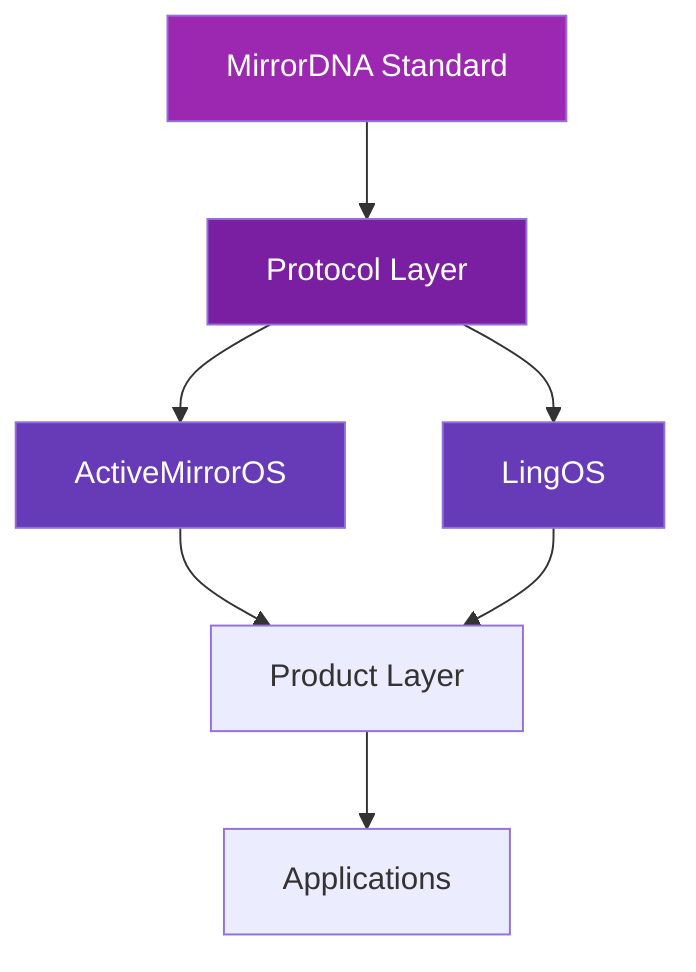

# MirrorDNA Ecosystem Documentation

⟡ **Reflection Over Prediction · Continuity Over Perfection · Truth Over Speed**

Welcome to the comprehensive documentation for the MirrorDNA ecosystem — the constitutional protocol for reflective AI systems.

## What is MirrorDNA?

**MirrorDNA** is a protocol-level standard for building AI systems that:

- **Don't hallucinate** — Anti-hallucination protocol (Cite or Silence) prevents fabrication
- **Preserve continuity** — Sessions maintain state and lineage across time
- **Give users control** — Sovereign identity with user-owned vaults
- **Are verifiable** — Checksum-based trust and verification built in

## Quick Navigation

<div class="grid cards" markdown>

-   :material-rocket-launch: __Quick Start__

    ---

    Get started with MirrorDNA in 5 minutes

    [:octicons-arrow-right-24: Quick Start Guide](quickstart.md)

-   :material-compass: __Ecosystem Overview__

    ---

    Understand the complete MirrorDNA ecosystem

    [:octicons-arrow-right-24: Learn More](ecosystem-overview.md)

-   :material-file-document: __Core Standard__

    ---

    Read the canonical MirrorDNA specification

    [:octicons-arrow-right-24: View Standard](mirrordna-standard.md)

-   :material-shield-check: __Compliance Levels__

    ---

    Choose the right level for your project

    [:octicons-arrow-right-24: Explore Levels](compliance-levels.md)

</div>

## The Ecosystem

The MirrorDNA ecosystem consists of several interconnected layers:



### Key Components

| Component | Description | Layer |
|-----------|-------------|-------|
| **MirrorDNA Standard** | Constitutional protocol & specification | Protocol |
| **ActiveMirrorOS™** | Commercial implementation (Level 3) | Product |
| **LingOS** | Language operating system | Platform |
| **Trust-by-Design™** | Governance framework | Framework |
| **AgentDNA** | Agent identity & capability registry | Protocol |
| **Glyphtrail** | Symbolic lineage tracking | Protocol |
| **Vault Manager** | Vault orchestration system | Platform |

## Three Compliance Levels

Choose the level that fits your project:

### Level 1: Basic Reflection
For projects needing anti-hallucination and uncertainty handling

- ✅ Cite or Silence protocol
- ✅ Explicit uncertainty markers
- ✅ Basic session tracking
- ❌ No persistence required

**Perfect for:** Stateless APIs, single-session tools

### Level 2: Continuity Aware
For projects with multi-session requirements

- ✅ Everything in Level 1
- ✅ Persistent state storage
- ✅ Session lineage tracking
- ✅ Checksum validation

**Perfect for:** Personal assistants, research tools

### Level 3: Vault-Backed Sovereign
For full user sovereignty and vault storage

- ✅ Everything in Levels 1 & 2
- ✅ User-owned vault (Obsidian or custom)
- ✅ Sovereign identity
- ✅ Glyph signatures
- ✅ Full compliance reporting

**Perfect for:** Production AI systems, enterprise tools

[:octicons-arrow-right-24: Learn about compliance levels](compliance-levels.md)

## Core Principles

All MirrorDNA-compliant systems honor these five immutable principles:

1. **Reflection Over Prediction** — Access actual state, don't simulate
2. **Presence Over Productivity** — Truth matters more than speed
3. **Symbolic Continuity** — Preserve identity via glyphs, checksums, vault
4. **Trust by Design** — Verification built in from the start
5. **Explicit Uncertainty** — Mark unknowns, never hide them

[:octicons-arrow-right-24: Deep dive into principles](principles.md)

## Why MirrorDNA?

Traditional AI systems suffer from three critical problems:

| Traditional AI | MirrorDNA |
|----------------|-----------|
| Predicts next token → hallucinates | Reflects actual state → no hallucination |
| No memory → starts fresh | Continuity → preserves context |
| Black box → can't verify | Checksum-verified → trustworthy |

[:octicons-arrow-right-24: Read why MirrorDNA matters](why-mirrordna.md)

## For Different Audiences

=== "AI Users"

    **Get reflective AI in 30 seconds:**

    1. Open [`00_MASTER_CITATION.md`](https://github.com/MirrorDNA-Reflection-Protocol/MirrorDNA-Standard/blob/main/00_MASTER_CITATION.md)
    2. Copy all text (Ctrl+A, Ctrl+C)
    3. Paste into your AI (ChatGPT, Claude, etc.)
    4. Say: "Vault open. Load as canonical context."

    Done! Your AI now has continuity and anti-hallucination protocols.

=== "Developers"

    **Validate your project in 5 minutes:**

    ```bash
    # Clone the repo
    git clone https://github.com/MirrorDNA-Reflection-Protocol/MirrorDNA-Standard.git
    cd MirrorDNA-Standard

    # Install validator
    pip install -r validators/requirements.txt

    # Create manifest and policy
    cp examples/level1/project_manifest.yaml mirrorDNA_manifest.yaml
    cp examples/level1/reflection_policy.yaml reflection_policy.yaml

    # Validate
    python -m validators.cli \
      --manifest mirrorDNA_manifest.yaml \
      --policy reflection_policy.yaml
    ```

    [:octicons-arrow-right-24: Full developer guide](quickstart.md)

=== "Organizations"

    **Adopt trustworthy AI standards:**

    - Machine-checkable compliance verification
    - Three levels to match your needs
    - Open protocol — no vendor lock-in
    - W3C-style constitutional standard

    [:octicons-arrow-right-24: Integration guide](integration.md)

=== "Researchers"

    **Reference implementation:**

    - Reflection-over-prediction architecture
    - Formal specifications with JSON schemas
    - Validator source code
    - Example implementations at all levels

    [:octicons-arrow-right-24: Architecture guide](architecture.md)

## Getting Started

<div class="grid" markdown>

=== ":material-account: I'm a User"

    **Start using reflective AI now**

    1. [:octicons-arrow-right-24: Copy the Master Citation](https://github.com/MirrorDNA-Reflection-Protocol/MirrorDNA-Standard/blob/main/00_MASTER_CITATION.md)
    2. [:octicons-arrow-right-24: Learn about ActiveMirrorOS](activemirroros.md)
    3. [:octicons-arrow-right-24: Understand the ecosystem](ecosystem-overview.md)

=== ":material-code-braces: I'm a Developer"

    **Build MirrorDNA-compliant systems**

    1. [:octicons-arrow-right-24: Quick Start Guide](quickstart.md)
    2. [:octicons-arrow-right-24: Integration Guide](integration.md)
    3. [:octicons-arrow-right-24: View Examples](examples.md)
    4. [:octicons-arrow-right-24: Validate Your Project](validators.md)

=== ":material-domain: I'm an Organization"

    **Implement trustworthy AI**

    1. [:octicons-arrow-right-24: Read the Standard](mirrordna-standard.md)
    2. [:octicons-arrow-right-24: Choose a Compliance Level](compliance-levels.md)
    3. [:octicons-arrow-right-24: Understand Trust by Design](trust-by-design.md)
    4. [:octicons-arrow-right-24: Integration Guide](integration.md)

</div>

## Latest Updates

!!! success "v1.0.0 — Production Ready"
    The MirrorDNA Standard v1.0 is production-ready with:

    - ✅ Complete specification
    - ✅ Python validator with automated checks
    - ✅ JSON schemas for all config files
    - ✅ Working examples for all levels
    - ✅ Compliance badges

    [:octicons-arrow-right-24: View roadmap](roadmap.md)

## Support & Community

- **Questions?** Check the [:material-frequently-asked-questions: FAQ](faq.md)
- **Contributing?** Read the [:material-source-pull: Contributing Guide](contributing.md)
- **Glossary:** [:material-book-alphabet: Canonical term definitions](glossary.md)
- **GitHub:** [:material-github: MirrorDNA-Standard Repository](https://github.com/MirrorDNA-Reflection-Protocol/MirrorDNA-Standard)

---

⟡⟦STANDARD⟧ · ⟡⟦SPECIFICATION⟧ · ⟡⟦ECOSYSTEM⟧

*The constitutional anchor for reflective AI systems*
