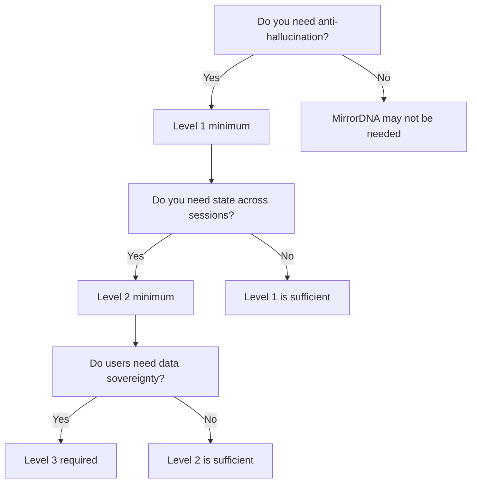

# Integration Guide

Learn how to integrate MirrorDNA into your existing projects.

---

## Overview

MirrorDNA is designed to be **incrementally adoptable**. You don't need to rewrite your entire application to gain the benefits of reflective computing.

!!! tip "Start Small, Scale Up"
    Begin with Level 1 (basic reflection), then add continuity (Level 2) and vault sovereignty (Level 3) as needed.

---

## Integration Approaches

### Approach 1: Configuration-Only (Fastest)

**Best for:** Projects that already follow good practices

**Time:** 15-30 minutes

**Steps:**

1. Create MirrorDNA configuration files
2. Run validator to verify compliance
3. Add badge to README

**Example:**

```bash
# Your existing project
my-ai-app/
├── src/
├── tests/
└── README.md

# Add MirrorDNA configs
my-ai-app/
├── src/
├── tests/
├── mirrorDNA_manifest.yaml        # ← Add
├── reflection_policy.yaml          # ← Add
└── README.md
```

### Approach 2: Protocol Integration (Recommended)

**Best for:** Projects that want anti-hallucination and explicit uncertainty

**Time:** 1-4 hours

**Steps:**

1. Add configuration files (as above)
2. Implement cite-or-silence protocol in your code
3. Add trust markers (`[Unknown]`, `[Speculation]`)
4. Validate with checker

**Code changes:**

=== "Python"

    ```python
    # Before MirrorDNA
    def answer_question(question):
        return model.generate(question)

    # After MirrorDNA (Level 1)
    def answer_question(question):
        # Search knowledge base first
        sources = knowledge_base.search(question)

        if sources:
            # Cite sources
            answer = model.generate(question, context=sources)
            return f"{answer}\n\nSource: {sources[0].citation}"
        else:
            # Silence with marker
            return "[Unknown] I don't have verified information about this."
    ```

=== "JavaScript"

    ```javascript
    // Before MirrorDNA
    async function answerQuestion(question) {
      return await model.generate(question);
    }

    // After MirrorDNA (Level 1)
    async function answerQuestion(question) {
      // Search knowledge base first
      const sources = await knowledgeBase.search(question);

      if (sources.length > 0) {
        // Cite sources
        const answer = await model.generate(question, { context: sources });
        return `${answer}\n\nSource: ${sources[0].citation}`;
      } else {
        // Silence with marker
        return "[Unknown] I don't have verified information about this.";
      }
    }
    ```

### Approach 3: Full Continuity (Advanced)

**Best for:** Projects that need session persistence and state tracking

**Time:** 1-2 days

**Steps:**

1. All of Approach 2
2. Add state persistence layer
3. Implement session tracking
4. Add continuity profile configuration
5. Validate as Level 2+

---

## Choosing Your Compliance Level

!!! question "Which Level Do I Need?"

Use this decision tree:



### Level 1: Basic Reflection

**Requirements:**

- Cite-or-silence protocol (AHP)
- Explicit uncertainty markers (`[Unknown]`, `[Speculation]`)
- Basic session tracking
- At least one trust marker

**No persistent state required**

**Example use cases:**

- Chatbots with knowledge bases
- Q&A systems
- Documentation assistants
- Customer support agents

**Configuration:**

```yaml
# mirrorDNA_manifest.yaml
name: "MyChatbot"
version: "1.0.0"
mirrorDNA_compliance_level: "level_1_basic_reflection"
layers:
  mirrorDNA_protocol: true
  trustByDesign: true
reflection_policy: "reflection_policy.yaml"
```

### Level 2: Continuity Aware

**Requirements:**

- Everything in Level 1 PLUS:
- Persistent state storage
- Session lineage tracking
- Checksum validation
- Session recovery capability

**Example use cases:**

- Personal assistants
- Long-running conversations
- Multi-session workflows
- Research tools

**Configuration:**

```yaml
# mirrorDNA_manifest.yaml
name: "MyAssistant"
version: "1.0.0"
mirrorDNA_compliance_level: "level_2_continuity_aware"
layers:
  mirrorDNA_protocol: true
  trustByDesign: true
reflection_policy: "reflection_policy.yaml"
continuity_profile: "continuity_profile.yaml"
```

**State persistence example:**

```python
# session_manager.py
class SessionManager:
    def __init__(self, storage_path):
        self.storage = storage_path
        self.current_session = None

    def create_session(self, user_id, predecessor=None):
        session = {
            "session_id": generate_uuid(),
            "user_id": user_id,
            "timestamp": datetime.utcnow().isoformat(),
            "predecessor": predecessor,
            "state": {}
        }
        self.save_session(session)
        return session

    def save_session(self, session):
        path = f"{self.storage}/{session['session_id']}.json"
        with open(path, 'w') as f:
            json.dump(session, f, indent=2)

        # Calculate checksum
        checksum = hashlib.sha256(
            json.dumps(session).encode()
        ).hexdigest()

        # Save checksum
        with open(f"{path}.sha256", 'w') as f:
            f.write(checksum)
```

### Level 3: Vault-Backed Sovereign

**Requirements:**

- Everything in Level 1 & 2 PLUS:
- User-owned vault (Obsidian or custom)
- Sovereign identity (user owns vault_id)
- Glyph signatures
- Comprehensive interaction safety
- Full compliance reporting

**Example use cases:**

- Personal knowledge management
- Private AI assistants
- Sovereign data systems
- Enterprise compliance tools

**Configuration:**

```yaml
# mirrorDNA_manifest.yaml
name: "MyVault"
version: "1.0.0"
mirrorDNA_compliance_level: "level_3_vault_backed_sovereign"
layers:
  mirrorDNA_protocol: true
  trustByDesign: true
  activeMirrorOS: false  # Optional product layer
reflection_policy: "reflection_policy.yaml"
continuity_profile: "continuity_profile.yaml"
vault_config: "vault_config.yaml"
```

---

## Common Integration Patterns

### Pattern 1: Wrapper Pattern

Wrap your existing AI model with MirrorDNA protocols:

```python
from mirrordna import ReflectiveWrapper

# Your existing model
model = MyAIModel()

# Wrap with MirrorDNA
reflective_model = ReflectiveWrapper(
    model=model,
    policy="reflection_policy.yaml",
    storage="./continuity"
)

# Use as before, but now it's MirrorDNA compliant
response = reflective_model.generate("What is the capital of France?")
# Output: "Paris (Source: knowledge_base/geography.json)"
```

### Pattern 2: Middleware Pattern

Add MirrorDNA as middleware in your request pipeline:

```python
from flask import Flask
from mirrordna.middleware import MirrorDNAMiddleware

app = Flask(__name__)
app.wsgi_app = MirrorDNAMiddleware(
    app.wsgi_app,
    manifest="mirrorDNA_manifest.yaml"
)

@app.route("/ask")
def ask():
    # Automatically includes cite-or-silence
    # and session tracking
    return {"answer": process_question(request.args.get("q"))}
```

### Pattern 3: Decorator Pattern

Decorate functions with MirrorDNA compliance:

```python
from mirrordna import cite_or_silence, track_session

@cite_or_silence(marker="[Unknown]")
@track_session(storage="./sessions")
def answer_question(question, session_id):
    sources = search_knowledge_base(question)

    if not sources:
        # Decorator will add [Unknown] marker
        return None

    return generate_answer(question, sources)
```

---

## Migration Strategies

### From Existing RAG Systems

If you already have Retrieval-Augmented Generation:

1. **Keep your RAG pipeline** - MirrorDNA works with it
2. **Add cite-or-silence** - Expose source citations explicitly
3. **Add trust markers** - Mark when sources aren't found
4. **Add session tracking** - Preserve context across queries

### From Stateless Chatbots

If your bot doesn't preserve state:

1. **Start with Level 1** - Add cite-or-silence first
2. **Add session storage** - Simple JSON files work
3. **Track lineage** - Link sessions via predecessor/successor
4. **Upgrade to Level 2** - Once storage is working

### From Proprietary Systems

If you use closed AI platforms (OpenAI, Anthropic, etc.):

1. **Use as-is** - Don't need to change the model
2. **Add verification layer** - Check outputs for hallucinations
3. **Add citation tracking** - Log what sources were used
4. **Validate outputs** - Ensure cite-or-silence compliance

---

## Configuration Examples

### Minimal Level 1 Config

```yaml
# mirrorDNA_manifest.yaml
name: "SimpleChatbot"
version: "1.0.0"
mirrorDNA_compliance_level: "level_1_basic_reflection"
layers:
  mirrorDNA_protocol: true
reflection_policy: "reflection_policy.yaml"
```

```yaml
# reflection_policy.yaml
policy_version: "1.0.0"
reflection_mode: "constitutive"
uncertainty_handling:
  cite_or_silence: true
  unknown_marker: "[Unknown]"
anti_hallucination:
  source_citation: true
trust_markers:
  - marker: "[Unknown]"
    meaning: "Information not available"
```

### Production Level 2 Config

```yaml
# continuity_profile.yaml
profile_version: "1.0.0"
continuity_mechanism: "local_state"

state_persistence:
  enabled: true
  storage_type: "file_system"
  storage_location: "./data/sessions"
  encryption: true
  checksum_validation: true

session_management:
  session_tracking: true
  session_id_format: "UUID"
  session_inheritance: true

continuity_guarantees:
  identity_preservation: true
  state_consistency: true
  lineage_tracking: true
  anti_hallucination: true
```

---

## Testing Your Integration

### 1. Schema Validation

```bash
# Validate YAML structure
python -m validators.cli \
  --manifest mirrorDNA_manifest.yaml \
  --policy reflection_policy.yaml
```

### 2. Runtime Testing

```python
# test_mirrordna.py
import pytest
from your_app import answer_question

def test_cite_or_silence():
    # Should cite when source exists
    response = answer_question("What is 2+2?")
    assert "Source:" in response or "[Unknown]" in response

def test_unknown_marker():
    # Should mark unknowns explicitly
    response = answer_question("What is the airspeed velocity of an unladen swallow?")
    assert "[Unknown]" in response

def test_no_hallucination():
    # Should not make up information
    response = answer_question("Tell me about XYZ123 that doesn't exist")
    assert "[Unknown]" in response
    assert "XYZ123" not in response.split("[Unknown]")[0]
```

### 3. Compliance Audit

Run the full validator suite:

```bash
pytest tests/ -v
python -m validators.cli --manifest mirrorDNA_manifest.yaml --policy reflection_policy.yaml
./tools/checksums/verify_repo_checksums.sh
```

---

## Troubleshooting

!!! warning "Common Issues"

### "Schema validation failed"

**Problem:** YAML structure doesn't match schema

**Solution:**
```bash
# Check YAML syntax
yamllint mirrorDNA_manifest.yaml

# Compare to examples
diff mirrorDNA_manifest.yaml examples/minimal_project_manifest.yaml
```

### "Cite-or-silence check failed"

**Problem:** Code doesn't implement cite-or-silence protocol

**Solution:**

- Add source citations to all factual claims
- Add `[Unknown]` markers when sources aren't available
- Never generate unsourced information

### "Session lineage missing"

**Problem:** Level 2 requires session tracking

**Solution:**

```python
# Add predecessor tracking
session = {
    "session_id": new_id,
    "predecessor": previous_session_id,  # ← Add this
    "timestamp": now()
}
```

---

## Next Steps

!!! success "Integration Complete?"

    === "Validate"
        Run `python -m validators.cli` to verify compliance

    === "Badge"
        Add the MirrorDNA badge to your README

    === "Document"
        Update your docs with MirrorDNA compliance details

    === "Share"
        Submit a PR to add your project to the ecosystem list

---

## Resources

- [Compliance Levels](compliance-levels.md) - Detailed requirements
- [Examples](examples.md) - Working configurations
- [Validators](validators.md) - CLI reference
- [FAQ](faq.md) - Common questions
