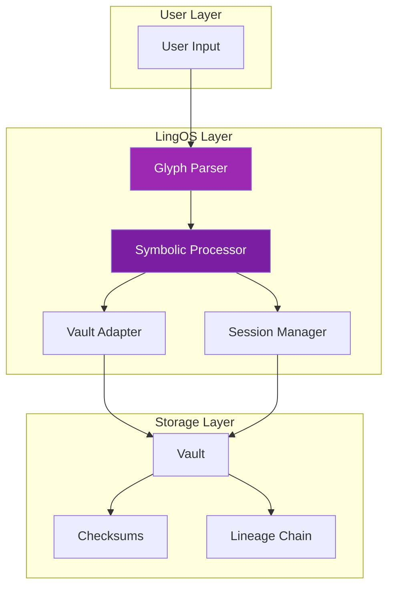

# LingOS: Language Operating System

**LingOS** (Language Operating System) is the symbolic and linguistic layer that sits between users and reflective AI systems, providing language-native interfaces for reflective computing.

## Overview

LingOS provides the platform layer for:

- **Glyph rendering and processing**
- **Vault-native file operations**
- **Session boundary management**
- **Reflection chain visualization**
- **Symbolic computation**

---

## Two Variants

LingOS comes in two variants to match different compliance levels:

### LingOS Lite

**Target:** Level 1 & 2 compliance

**Features:**

- ✅ Basic glyph rendering
- ✅ Minimal symbolic processing
- ✅ Session tracking primitives
- ✅ Simple vault operations
- ✅ Open source (MIT license)

**Status:** 🚧 Beta (v0.8.0)

**Use cases:**

- Single-session applications
- Lightweight integrations
- Educational tools
- Development prototyping

---

### LingOS Pro

**Target:** Level 3 compliance

**Features:**

- ✅ All LingOS Lite features
- ✅ Advanced glyph kernel
- ✅ Multi-vault orchestration
- ✅ Symbolic computation engine
- ✅ Reflection chain analytics
- ✅ Commercial support

**Status:** 🔬 Alpha (v0.5.0)

**Use cases:**

- Production AI systems
- Enterprise deployments
- Vault-backed sovereign systems
- ActiveMirrorOS integration

---

## Core Concepts

### Glyph Language

LingOS provides a command language based on glyphs:

```
⟡⟦OPEN⟧ vault/session-2025-01-15
⟡⟦READ⟧ notes/reflection.md
⟡⟦VERIFY⟧ checksum
⟡⟦SEAL⟧ output.md
```

**Standard Glyphs:**

| Glyph | Meaning | Usage |
|-------|---------|-------|
| `⟡⟦OPEN⟧` | Open resource | Vault, session, file |
| `⟡⟦READ⟧` | Read from vault | Read operations |
| `⟡⟦WRITE⟧` | Write to vault | Write operations |
| `⟡⟦VERIFY⟧` | Verify integrity | Checksum validation |
| `⟡⟦SEAL⟧` | Mark as immutable | Canonical artifacts |
| `⟡⟦CONTINUITY⟧` | Continuity marker | Session lineage |

---

### Vault Operations

LingOS provides vault-native operations:

```python
from lingos import Vault, Session

# Open vault
vault = Vault("/path/to/vault")

# Create session
session = Session(
    vault=vault,
    session_id="2025-01-15-1430",
    predecessor="2025-01-14-0900"
)

# Read from vault
content = vault.read("notes/reflection.md")

# Verify integrity
is_valid = vault.verify_checksum(content)

# Write with lineage
vault.write(
    path="notes/new-reflection.md",
    content=new_content,
    predecessor="notes/reflection.md",
    glyphsig="⟡⟦CONTINUITY⟧ · ⟡⟦SESSION⟧"
)
```

---

### Session Management

LingOS manages session boundaries and inheritance:

```yaml
# Session config
session:
  id: "2025-01-15-1430"
  vault_id: "AMOS://User/MyVault/v1.0"
  predecessor: "2025-01-14-0900"
  successor: null
  start_time: "2025-01-15T14:30:00Z"
  end_time: null
  status: "active"
```

**Features:**

- **Automatic lineage tracking**
- **Session inheritance** (state from previous session)
- **Snapshot on close**
- **Recovery from snapshots**

---

### Symbolic Computation

LingOS Pro includes a symbolic computation engine:

```python
from lingos.symbolic import GlyphKernel

kernel = GlyphKernel()

# Define symbolic rules
kernel.define_rule(
    pattern="⟡⟦REFLECT⟧(x)",
    action=lambda x: vault.reflect(x)
)

# Execute symbolic computation
result = kernel.eval("⟡⟦REFLECT⟧(previous_decision)")
```

---

## Architecture



---

## Integration with MirrorDNA

### Level 1 Integration

```yaml
# mirrorDNA_manifest.yaml
layers:
  lingOS: true
  lingOS_variant: "lite"

lingOS_config:
  glyph_rendering: true
  session_tracking: "basic"
```

### Level 2 Integration

```yaml
# mirrorDNA_manifest.yaml
layers:
  lingOS: true
  lingOS_variant: "lite"

lingOS_config:
  glyph_rendering: true
  session_tracking: "full"
  vault_operations: true
  checksum_validation: true
```

### Level 3 Integration

```yaml
# mirrorDNA_manifest.yaml
layers:
  lingOS: true
  lingOS_variant: "pro"

lingOS_config:
  glyph_kernel: true
  multi_vault: true
  symbolic_computation: true
  reflection_analytics: true
```

---

## Installation

### LingOS Lite

=== "Python"

    ```bash
    pip install lingos-lite
    ```

    ```python
    from lingos import Vault, Session

    vault = Vault("/path/to/vault")
    session = Session(vault)
    ```

=== "JavaScript"

    ```bash
    npm install @lingos/lite
    ```

    ```javascript
    import { Vault, Session } from '@lingos/lite';

    const vault = new Vault('/path/to/vault');
    const session = new Session(vault);
    ```

### LingOS Pro

Contact sales for enterprise licensing and installation.

---

## Features Comparison

| Feature | Lite | Pro |
|---------|------|-----|
| Glyph rendering | ✅ | ✅ |
| Basic vault ops | ✅ | ✅ |
| Session tracking | ✅ | ✅ |
| Checksum validation | ✅ | ✅ |
| Glyph kernel | ❌ | ✅ |
| Multi-vault | ❌ | ✅ |
| Symbolic computation | ❌ | ✅ |
| Reflection analytics | ❌ | ✅ |
| Commercial support | ❌ | ✅ |
| License | MIT | Commercial |
| Price | Free | Contact sales |

---

## Use Cases

### Personal Knowledge Management

```python
# Create a reflective note-taking system
vault = Vault("~/obsidian-vault")

note = vault.create_note(
    title="Daily Reflection",
    template="reflection",
    glyphsig="⟡⟦CONTINUITY⟧ · ⟡⟦PERSONAL⟧"
)

# LingOS automatically:
# - Links to predecessor notes
# - Calculates checksums
# - Tracks lineage
```

### AI Agent Development

```python
from lingos import Agent

agent = Agent(
    vault="/path/to/agent-vault",
    capabilities=["text_generation", "vault_reflection"]
)

# Agent uses LingOS for:
# - State persistence
# - Session continuity
# - Checksum verification
```

### Research Tools

```python
# Research assistant with continuity
research_vault = Vault("/research/project")

session = Session(
    vault=research_vault,
    mode="research",
    literature_db="/path/to/papers"
)

# LingOS provides:
# - Citation tracking
# - Source verification
# - Lineage of insights
```

---

## Roadmap

### Q1 2025 (Current)

- 🚧 LingOS Lite v1.0 stabilization
- 🚧 Python SDK improvements
- 🚧 Documentation expansion

### Q2 2025

- LingOS Lite v1.0 stable release
- JavaScript/TypeScript SDK
- VS Code extension
- Obsidian plugin

### Q3 2025

- LingOS Pro v1.0 beta
- Multi-vault orchestration
- Advanced glyph kernel
- Commercial launch

### Q4 2025+

- Network protocols
- Distributed vaults
- Cross-device sync
- Mobile SDKs

[:octicons-arrow-right-24: Full ecosystem roadmap](roadmap.md)

---

## Documentation

### For Users

- Installation guides
- Glyph reference
- Vault setup
- Session management

### For Developers

- API reference
- SDK documentation
- Integration examples
- Custom vault adapters

### Resources

- GitHub: [LingOS Repository](#) (coming soon)
- Examples: See `examples/` directory
- Community: [Discussions](#)

---

## Related Components

- **MirrorDNA Standard:** Constitutional protocol
- **ActiveMirrorOS:** Uses LingOS Pro
- **Vault Manager:** Orchestrates vaults
- **Glyphtrail:** Tracks symbolic lineage

[:octicons-arrow-right-24: Ecosystem overview](ecosystem-overview.md)

---

⟡⟦LINGOS⟧ · ⟡⟦PLATFORM⟧ · ⟡⟦LANGUAGE-OS⟧

*Language-native interface for reflective computing*
