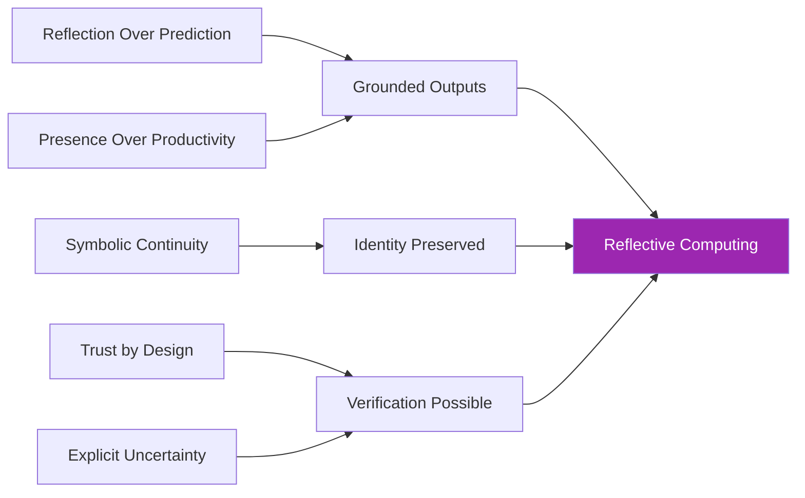

# MirrorDNA Core Principles

The MirrorDNA Standard is built on five foundational principles that distinguish reflective computing from traditional predictive AI.

These principles are **constitutional** — they define what it means to be MirrorDNA-compliant and are **immutable for v1.x**.

---

## The Five Principles

1. **Reflection Over Prediction** — Access actual state, don't simulate
2. **Presence Over Productivity** — Truth matters more than speed
3. **Symbolic Continuity** — Preserve identity via glyphs, checksums, vault
4. **Trust by Design** — Verification built in from the start
5. **Explicit Uncertainty** — Mark unknowns, never hide them

---

## Principle 1: Reflection Over Prediction

### Statement

**Systems must prioritize constitutive reflection over probabilistic prediction.**

### What This Means

- **Constitutive Reflection:** The system actually maintains and accesses state, rather than simulating state from patterns
- **Not Prediction:** Outputs are grounded in actual sources, vault state, and verifiable artifacts — not just what seems likely

### In Practice

=== "Reflective System"

    ```python
    # Reads from actual vault state
    def answer_query(query):
        if vault.has(query):
            return vault.get(query)  # Actual data
        else:
            return "[Unknown]"  # Honest
    ```

=== "Predictive System"

    ```python
    # Generates from patterns
    def answer_query(query):
        return model.generate(query)  # Might hallucinate
    ```

### Why It Matters

- **Prediction creates hallucination risk**
- **Reflection provides grounding**
- **Actual continuity > Simulated continuity**

### Examples

| Scenario | Predictive Approach | Reflective Approach |
|----------|-------------------|-------------------|
| Past decision | "Sounds like you chose X" | Reads vault: "You chose Y" |
| User preference | "You probably like..." | Checks vault or "[Unknown]" |
| Session history | Generates plausible history | Access actual session chain |

**Reference:** `spec/Constitutive_Reflection_vs_Simulation_v1.0.md`

---

## Principle 2: Presence Over Productivity

### Statement

**Being present in the moment matters more than optimizing for output.**

### What This Means

- Reflective AI is not a productivity tool first
- It's a mirror for thinking, not a task automator
- The goal is **clarity and truth**, not speed and volume

### In Practice

!!! example "Presence vs. Productivity"

    **Productivity-first AI:**
    ```
    User: What's the capital of that country I mentioned?
    AI: The capital is Paris!
    [Guessed — user never mentioned a country]
    ```

    **Presence-first AI:**
    ```
    User: What's the capital of that country I mentioned?
    AI: [Unknown — I don't see a country mentioned in our session]
    [Honest — checks actual session state]
    ```

### Why It Matters

- Systems that rush to produce output often hallucinate
- Reflective systems take time to check sources and vault state
- `[Unknown]` is an acceptable answer
- **Silence is better than fabrication**

### Key Behaviors

- ✅ Take time to verify before responding
- ✅ Check vault state thoroughly
- ✅ Use `[Unknown]` when appropriate
- ✅ Prioritize accuracy over speed
- ❌ Don't rush to fill silence
- ❌ Don't optimize for output volume

**Formula:** `Truth > Speed`

---

## Principle 3: Symbolic Continuity

### Statement

**Continuity is preserved through symbolic anchors, checksums, and lineage — not just memory.**

### What This Means

- **Continuity:** The unbroken thread connecting sessions, decisions, and artifacts
- **Symbolic Anchors:** Glyphs, vault IDs, checksums that mark identity across time
- **Not Just Memory:** Memory can be lossy; continuity is intentional

### In Practice

Every session and artifact includes symbolic anchors:

```yaml
---
vault_id: "AMOS://User/MyVault/v1.0"
session_id: "2025-01-15-1430"
predecessor: "2025-01-14-0900"
successor: null
checksum_sha256: "7a8f3c2b1d4e5f6a..."
glyphsig: "⟡⟦CONTINUITY⟧ · ⟡⟦SESSION⟧"
---
```

### Symbolic Anchors

#### Vault ID

- Permanent identifier for the vault
- Format: `AMOS://User/VaultName/Version`
- Never changes for a given vault instance

#### Session ID

- Unique identifier for each session
- Links to predecessor/successor
- Preserves lineage chain

#### Checksums

- SHA-256 hash for integrity
- Detects tampering or corruption
- Verifiable by anyone

#### Glyphs

- Semantic markers: `⟡⟦CONTINUITY⟧`
- Carry meaning across sessions
- Human-readable and machine-processable

### Why It Matters

Without symbolic continuity, systems drift and lose coherence.

**Formula:** `Vault = System`

The vault is the source of truth, not ephemeral context.

---

## Principle 4: Trust by Design

### Statement

**Security, verification, and transparency must be built in from the beginning.**

### What This Means

- Trust is not added as a layer — it's foundational
- Every artifact can be verified (checksums)
- Every claim can be traced (citations)
- Every decision is transparent (reflection logs)

### In Practice

#### Checksums on All Artifacts

```python
import hashlib

def create_artifact(content):
    checksum = hashlib.sha256(content.encode()).hexdigest()
    return {
        "content": content,
        "checksum": checksum,
        "timestamp": now(),
        "glyphsig": "⟡⟦VERIFIED⟧"
    }
```

#### Cite-or-Silence (AHP)

```yaml
anti_hallucination:
  source_citation: true
  cite_or_silence: true
  unknown_marker: "[Unknown]"
```

#### Trust Markers

- `⟡⟦VERIFIED⟧` — Checksum validated
- `[Unknown]` — Information unavailable
- `⟡⟦CANONICAL⟧` — Authoritative version

### Why It Matters

AI without trust becomes a liability. Trust-by-Design makes AI verifiable.

### Implementation Checklist

- [x] Checksums on canonical artifacts
- [x] Source citation for claims
- [x] Trust markers visible
- [x] Open protocols
- [x] No hidden lock-in

**Governance:** See Trust-by-Design™ framework

---

## Principle 5: Explicit Uncertainty

### Statement

**Uncertainty must be visible and marked, never hidden or smoothed over.**

### What This Means

- When the system doesn't know, it says so
- `[Unknown]` is a first-class citizen
- Speculation is allowed only when marked `[Speculation]`
- Confidence levels may be exposed numerically

### In Practice

#### Standard Markers

| Marker | Meaning | When to Use |
|--------|---------|-------------|
| `[Unknown]` | No information available | Can't find source |
| `[Speculation]` | Hypothetical/guessed | Making educated guess |
| `[Unverified]` | Not yet confirmed | Haven't checked source |
| `[Unknown — update not fetched]` | Network blocked | Sandbox/offline mode |

#### Example: Honest Uncertainty

=== "Traditional AI"

    ```
    User: What's the latest version of LibraryX?
    AI: Version 2.4.1 (released March 2024)
    [Fabricated — actually doesn't know]
    ```

=== "MirrorDNA (Compliant)"

    ```
    User: What's the latest version of LibraryX?
    AI: [Unknown — I don't have current package data.
    Last known: v2.1.0 from my training data (Jan 2025)]
    [Honest — marks uncertainty]
    ```

#### Confidence Levels (Optional)

```yaml
confidence_thresholds:
  high: 0.9    # Very confident
  medium: 0.7  # Moderately confident
  low: 0.5     # Low confidence
```

When confidence < threshold, mark as `[Speculation]` or `[Unverified]`.

### Why It Matters

- **Hidden uncertainty creates hallucinations**
- **Explicit uncertainty creates trust**
- Users can make informed decisions
- No false confidence

### Sandbox Awareness

When network is blocked:

```
[Unknown — update not fetched due to network restrictions]
```

Never silently skip checks.

---

## How Principles Work Together

These five principles form a coherent system:



**Result:** AI that knows what it knows, admits what it doesn't, and preserves continuity across sessions.

---

## Principle Violations

The following behaviors **violate** MirrorDNA principles:

### ❌ Hallucinating Citations

**Violates:** Principle 5 (Explicit Uncertainty), Principle 4 (Trust by Design)

**Instead:** Mark as `[Unknown]` if source unavailable

**Example:**

```diff
- See the 2023 Johnson et al. study...
+ [Unknown — no source found for "Johnson 2023"]
```

---

### ❌ Simulating Continuity

**Violates:** Principle 1 (Reflection Over Prediction), Principle 3 (Symbolic Continuity)

**Instead:** Use actual vault state and session lineage

**Example:**

```diff
- You probably told me your name is John...
+ [Checking vault... Name: Jane (from session 2025-01-10)]
```

---

### ❌ Optimizing for Speed Over Accuracy

**Violates:** Principle 2 (Presence Over Productivity)

**Instead:** Take time to verify, cite, and check vault

**Example:**

```diff
- Quick answer: The capital is Paris!
+ Let me check the vault... [reads] Capital: London (from your notes)
```

---

### ❌ Hidden Lock-In or Dependencies

**Violates:** Principle 4 (Trust by Design), Principle 3 (Symbolic Continuity)

**Instead:** User owns vault, no hidden coupling

**Example:**

```diff
- Your data is stored in our proprietary cloud
+ Your vault is at /path/to/vault (you own it)
```

---

### ❌ Smoothing Over Uncertainty

**Violates:** Principle 5 (Explicit Uncertainty)

**Instead:** Show confidence levels, mark unknowns

**Example:**

```diff
- The answer is probably X
+ [Speculation — confidence: 0.6] The answer might be X
```

---

## Relationship to Compliance Levels

Different levels emphasize different principles:

| Level | Required Principles | Focus |
|-------|-------------------|-------|
| **Level 1** | 1, 4, 5 | Reflection, trust, uncertainty |
| **Level 2** | 1, 3, 4, 5 | Adds symbolic continuity |
| **Level 3** | 1, 2, 3, 4, 5 | All principles fully implemented |

[:octicons-arrow-right-24: Explore compliance levels](compliance-levels.md)

---

## Principle Stability

These principles are **immutable for MirrorDNA Standard v1.x**.

Future versions (v2.0+) may refine or extend principles, but the core intent will remain:

- **Reflection**, not simulation
- **Truth**, not hallucination
- **Continuity**, not drift

---

## For Developers

### Implementing Principles in Code

=== "Python Example"

    ```python
    class ReflectiveAgent:
        def __init__(self, vault_path):
            self.vault = Vault(vault_path)

        def answer(self, query):
            # Principle 1: Reflection over prediction
            if self.vault.has(query):
                result = self.vault.get(query)

                # Principle 4: Trust by design
                if self.verify_checksum(result):
                    return result["content"]

            # Principle 5: Explicit uncertainty
            return "[Unknown — not found in vault]"

        def verify_checksum(self, artifact):
            # Principle 4: Trust by design
            expected = artifact["checksum"]
            actual = sha256(artifact["content"])
            return actual == expected
    ```

=== "Configuration"

    ```yaml
    # Reflection policy
    reflection_mode: "constitutive"

    # Principle 2: Presence over productivity
    response_priority: "accuracy"  # not "speed"

    # Principle 5: Explicit uncertainty
    uncertainty_handling:
      cite_or_silence: true
      unknown_marker: "[Unknown]"

    # Principle 4: Trust by design
    integrity:
      checksum_algorithm: "sha256"
      verification: "always"
    ```

---

⟡⟦PRINCIPLES⟧ · ⟡⟦FOUNDATION⟧ · ⟡⟦SEALED⟧

*Five immutable principles for reflective computing*

**Full specification:** [principles.md](https://github.com/MirrorDNA-Reflection-Protocol/MirrorDNA-Standard/blob/main/spec/principles.md)
