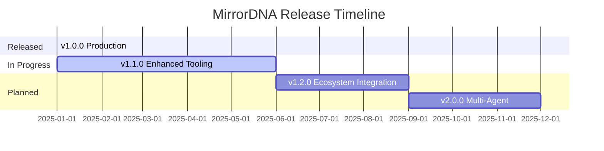

# Roadmap

**Current Version**: 1.0.0 (Production-ready)
**Last Updated**: 2025-11-14

---

## Vision

MirrorDNA-Standard will be the **W3C-style constitutional standard** for reflective AI systems — machine-checkable, vendor-neutral, and adoption-ready for any organization building trustworthy AI.

!!! abstract "Our Mission"
    To create an open, vendor-neutral standard that enables any organization to build reflective AI systems with true continuity, anti-hallucination protocols, and user sovereignty.

---

## v1.0.0 ✅ (Current — Released 2025-01)

**Status**: Production-ready

### Delivered

=== "Core Specification"

    - ✅ Core specification (mirrorDNA-standard-v1.0.md)
    - ✅ Five immutable principles
    - ✅ Three compliance levels (L1, L2, L3)
    - ✅ Glossary with canonical definitions

=== "Tooling"

    - ✅ Python validator CLI with automated checks
    - ✅ JSON schemas for all config files
    - ✅ Checksum verification tools
    - ✅ Pytest test suite

=== "Examples & Templates"

    - ✅ Working examples for all levels
    - ✅ Compliance badges (SVG)
    - ✅ Reference portable implementation (Electron app)
    - ✅ Obsidian vault template

### Known Limitations

!!! warning "Current Limitations"
    - Validator outputs plain text only (no JSON/YAML export yet)
    - Portable launcher missing production-ready LLM integration
    - No automated CI/CD badge generation
    - Limited internationalization (English only)

---

## v1.1.0 🚧 (In Progress — Target: Q2 2025)

**Theme**: Enhanced Tooling & Developer Experience

### Planned Features

=== "Validator Improvements"

    #### Enhanced Output Formats

    - [ ] JSON output format (`--format json`)
    - [ ] YAML output format (`--format yaml`)
    - [ ] Exit codes for CI/CD integration
    - [ ] Structured error messages with remediation hints
    - [ ] Batch validation (validate multiple projects at once)

=== "Capability Registry v1.1"

    #### Enhanced Capabilities

    - [x] Expert review claim removed (security fix)
    - [ ] Auto-detection of capabilities from code analysis
    - [ ] Capability evolution tracking (how capabilities change over time)

=== "Developer Experience"

    #### New Tools

    - [ ] Web-based validator (run in browser without install)
    - [ ] GitHub Action for automated validation
    - [ ] Badge generation service (auto-generate badges from validation)
    - [ ] VS Code extension with real-time validation

=== "Documentation"

    #### Learning Resources

    - [ ] Video tutorials (5-minute quickstart)
    - [ ] Case studies (3 real-world implementations)
    - [ ] Migration guides (from other frameworks)

!!! tip "Get Involved"
    Want to contribute to v1.1.0? Check out our [GitHub issues](https://github.com/MirrorDNA-Reflection-Protocol/MirrorDNA-Standard/issues) for ways to help.

---

## v1.2.0 📋 (Planned — Target: Q3 2025)

**Theme**: Ecosystem Integration & Adoption

### Planned Features

=== "Package Distribution"

    #### Multi-Platform Support

    - [ ] PyPI package (`pip install mirrordna-validator`)
    - [ ] npm package for JavaScript projects
    - [ ] Docker image for containerized validation
    - [ ] Homebrew formula for macOS

=== "Integration Tooling"

    #### Developer Tools

    - [ ] Obsidian plugin for vault-based projects
    - [ ] CLI wizard (`mirrordna init`) for new projects
    - [ ] Config file generator with interactive prompts
    - [ ] Migration scripts (Langchain → MirrorDNA, etc.)

=== "Compliance Reporting"

    #### Reporting Features

    - [ ] Compliance dashboard (web UI)
    - [ ] Historical compliance tracking
    - [ ] Team/organization multi-project view
    - [ ] Compliance certificate generation (PDF)

=== "Portable Application"

    #### Enhanced Features

    - [ ] Production-ready LLM integration (llama.cpp)
    - [ ] Model auto-download (Phi-3, Llama 3.2, Mistral)
    - [ ] Cross-device sync (Git-based)
    - [ ] Mobile companion app (iOS/Android read-only)

!!! info "Timeline"
    Q3 2025 target is provisional. Actual release depends on community feedback and development progress.

---

## v2.0.0 🔮 (Vision — Target: Q4 2025)

**Theme**: Multi-Agent & Network Protocols

### Proposed Features

=== "Network Layer"

    #### Network Protocols

    - [ ] MirrorDNA Protocol over HTTP/WebSockets
    - [ ] Agent-to-agent reflection protocol
    - [ ] Distributed vault synchronization
    - [ ] Blockchain anchoring (optional for Level 3)

=== "Multi-Agent Support"

    #### Agent Collaboration

    - [ ] Agent lineage graphs (multiple agents, one vault)
    - [ ] Collaborative reflection (multiple agents working together)
    - [ ] Trust delegation protocol
    - [ ] Inter-vault communication

=== "Advanced Compliance"

    #### New Compliance Features

    - [ ] Level 4: Networked Sovereign (multi-vault, multi-agent)
    - [ ] Formal verification tooling (proof-of-compliance)
    - [ ] Audit trail generation (tamper-evident logs)
    - [ ] Compliance analytics (insights from validation data)

=== "Internationalization"

    #### Multi-Language Support

    - [ ] Multi-language specs (Spanish, French, German, Japanese, Chinese)
    - [ ] Localized validators
    - [ ] Regional compliance variants

!!! note "v2.0 Vision"
    v2.0 represents a major evolution of the standard. Features are subject to change based on ecosystem needs and community feedback.

---

## v3.0.0 🌌 (Speculative — 2026+)

**Theme**: Standardization Body & Governance

### Vision

=== "Governance"

    #### Standardization Process

    - [ ] W3C-style standardization process
    - [ ] Community governance (steering committee)
    - [ ] Conformance testing program
    - [ ] Certified implementations registry
    - [ ] Annual conformance summit

!!! warning "Speculative"
    v3.0 features are speculative and may not be implemented as described. This represents our long-term vision for the standard.

---

## Non-Goals

What we will **NOT** do:

!!! danger "Out of Scope"

    ❌ **Build proprietary products** - This is a protocol, not a product

    ❌ **Vendor lock-in** - Anyone can implement the standard

    ❌ **Closed governance** - Always open, community-driven

    ❌ **Feature bloat** - Keep the core spec minimal

    ❌ **Breaking changes to v1.x principles** - Principles are immutable for v1.x

---

## How to Influence the Roadmap

We welcome community input on the roadmap! Here's how to get involved:

=== "GitHub"

    #### GitHub Participation

    - **Issues**: Propose features or report bugs
    - **Pull Requests**: Contribute code or documentation
    - **Discussions**: Join ecosystem conversations

=== "Case Studies"

    #### Share Your Story

    - Document your implementation experience
    - Share challenges and solutions
    - Help others learn from your journey

=== "Feedback"

    #### Provide Input

    - Review proposed features
    - Comment on roadmap priorities
    - Suggest new directions

!!! tip "Make Your Voice Heard"
    The roadmap is driven by real-world needs. Your feedback helps shape the future of MirrorDNA.

---

## Success Metrics

### Adoption Goals

| Version | Goal | Status |
|---------|------|--------|
| **v1.x** | 100 projects validated with MirrorDNA compliance | 🚀 In Progress |
| **v2.x** | 10 independent implementations (not just ActiveMirrorOS) | 📋 Planned |
| **v3.x** | Recognized by standards bodies (W3C, ISO, etc.) | 🔮 Vision |

### Community Metrics

!!! info "Progress Tracking"
    We track the following metrics to measure ecosystem health:

    - Number of compliant projects
    - Number of independent implementations
    - Community contributions (PRs, issues, discussions)
    - Documentation coverage
    - Validator usage statistics

---

## Related Projects

### Ecosystem Projects

| Project | Description | Status |
|---------|-------------|--------|
| **ActiveMirrorOS™** | Canonical Level 3 implementation | ✅ Production |
| **MirrorDNA Stress Harness** | Compliance testing under load | 🚧 Development |
| **LingOS** | Language operating system layer | 📋 Planned |
| **Vault Templates** | Community-contributed vault configurations | 🚀 Growing |

### Integration Partners

!!! success "Growing Ecosystem"
    We're building partnerships with:

    - Obsidian plugin developers
    - AI framework maintainers
    - Enterprise AI teams
    - Research institutions

---

## Version History

### Release Timeline

---

## Contributing to the Roadmap

### How Features Get Added

1. **Community Proposal** - Submit GitHub issue with feature request
2. **Discussion** - Community discusses merits and implementation
3. **Roadmap Review** - Core team evaluates fit with vision
4. **Prioritization** - Feature added to appropriate version milestone
5. **Implementation** - Community or core team implements
6. **Testing** - Comprehensive testing and validation
7. **Release** - Feature ships in target version

!!! tip "Start Small"
    The best contributions often start small. Consider:

    - Improving documentation
    - Adding examples
    - Fixing bugs
    - Reviewing proposals

---

## Related Documentation

- [Compliance Levels](compliance-levels.md) - Current compliance requirements
- [Glossary](glossary.md) - Definitions and terminology
- [MirrorDNA Standard](https://github.com/MirrorDNA-Reflection-Protocol/MirrorDNA-Standard/blob/main/spec/mirrorDNA-standard-v1.0.md) - Full specification

---

⟡⟦ROADMAP⟧

*This roadmap is a living document. Dates and features may change based on community feedback and ecosystem needs.*
