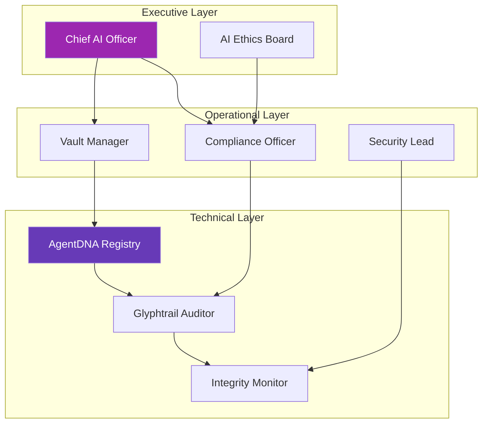
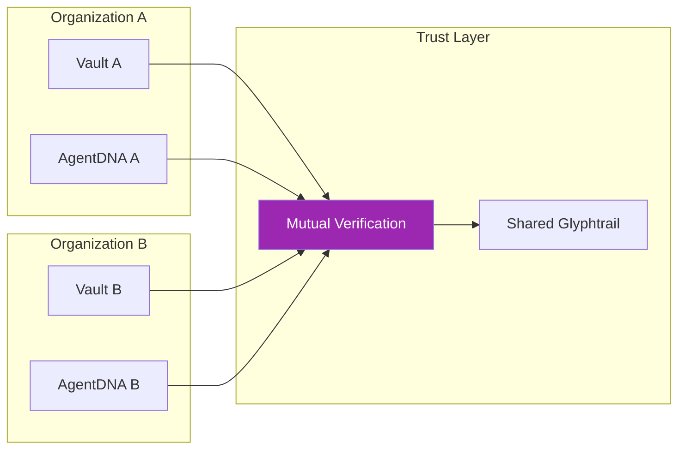

# Trust-by-Design: Governance Framework

**Trust-by-Design** is a comprehensive governance framework that extends MirrorDNA principles from individual AI systems into organizational, institutional, and multi-stakeholder environments.

## Overview

Trust-by-Design provides the conceptual and operational framework for deploying MirrorDNA-compliant AI systems in contexts where governance, compliance, and accountability are critical requirements.

**Core Philosophy:** Security, transparency, and auditability are not features to be added later — they must be designed in from the foundation.

---

## Framework Status

| Attribute | Value |
|-----------|-------|
| **Version** | v1.0.0 |
| **Status** | 📖 Conceptual Framework |
| **License** | CC BY-SA 4.0 (Creative Commons) |
| **Type** | Governance Framework |
| **Audience** | Enterprises, institutions, policymakers |

!!! info "Framework Nature"
    Trust-by-Design is a conceptual framework and set of principles, not a software product. It guides organizational adoption of MirrorDNA-compliant systems.

---

## The Five Principles

Trust-by-Design is built on five immutable principles that govern AI system design and deployment:

### 1. Verification First

**Principle:** Security and integrity are built into the foundation, not added as an afterthought.

**In Practice:**

- **Checksums mandatory:** Every artifact carries SHA-256 verification
- **Lineage tracking:** Predecessor/successor relationships recorded
- **Evidence-based claims:** Agents cite vault sources or stay silent
- **No unverified assertions:** Anti-hallucination protocol enforced

**Organizational Application:**

```yaml
verification_policy:
  artifact_integrity: "required"
  checksum_algorithm: "sha256"
  verification_frequency: "on_create, on_read, on_sync"

  failed_verification_action:
    - alert_admin
    - quarantine_artifact
    - trigger_audit
```

**Example:** Before an AI-generated legal brief is delivered to a client, its lineage is verified against vault records, checksums are validated, and all citations are confirmed.

---

### 2. Transparency

**Principle:** All decisions, actions, and reasoning chains must be traceable and accessible.

**In Practice:**

- **Complete Glyphtrail:** Every agent action logged with symbolic markers
- **Session logs accessible:** Users can review full conversation history
- **Configuration visible:** No hidden parameters or black-box settings
- **Decision chains:** From input → reasoning → output, all steps recorded

**Organizational Application:**

```yaml
transparency_requirements:
  decision_logging: "mandatory"
  session_retention: "7_years"  # or per regulatory requirement

  accessible_to:
    - primary_user
    - compliance_officer
    - external_auditor (with authorization)

  redaction_policy:
    - pii_protected
    - trade_secrets_masked
    - audit_trail_preserved
```

**Example:** A financial analyst uses AI to generate investment recommendations. The complete reasoning chain (market data → analysis → recommendation) is logged and auditable by compliance teams.

---

### 3. Auditability

**Principle:** Systems must support third-party audits and regulatory compliance reporting.

**In Practice:**

- **Export audit trails:** Compliance-ready formats (CSV, JSON, PDF reports)
- **Regulatory templates:** Pre-built exports for common frameworks
- **Third-party verification:** Independent auditors can validate integrity
- **Tamper-evident logs:** Checksums detect modifications to audit trails

**Organizational Application:**

```yaml
audit_configuration:
  export_formats:
    - csv_timeline
    - json_structured
    - pdf_report

  compliance_frameworks:
    - gdpr
    - hipaa
    - sox
    - eu_ai_act

  audit_frequency: "quarterly"
  retention_period: "10_years"
```

**Example:** During a regulatory audit, a healthcare provider exports complete Glyphtrail logs showing how AI-assisted diagnoses were made, including all data sources and reasoning steps.

---

### 4. Sovereignty

**Principle:** Users maintain ownership and control of their data, identity, and AI interactions.

**In Practice:**

- **User-owned vault:** Data stored in user-controlled location
- **Portable identity:** AgentDNA tied to vault, not vendor platform
- **No vendor lock-in:** Standard file formats enable migration
- **Offline capability:** Core functions work without cloud dependency

**Organizational Application:**

```yaml
sovereignty_policy:
  vault_ownership: "organization"
  vault_location: "on_premise"  # or "eu_cloud", "encrypted_cloud"

  data_portability: "guaranteed"
  export_formats:
    - markdown
    - json
    - yaml

  vendor_dependencies:
    - llm_provider: "swappable"
    - vault_backend: "standardized"
```

**Example:** A law firm maintains complete control over client vault data, stored on-premise. They can switch LLM providers without losing continuity or needing to migrate proprietary formats.

---

### 5. Accountability

**Principle:** Clear responsibility chains for AI outputs, with attribution to both human and AI contributors.

**In Practice:**

- **Agent identity:** AgentDNA declares capabilities and limitations
- **Human anchor:** Every vault tied to responsible human
- **Attribution:** All outputs tagged with creator (human + agent)
- **Capability boundaries:** Agents declare what they can/cannot do

**Organizational Application:**

```yaml
accountability_structure:
  human_anchor:
    role: "Chief Data Officer"
    responsibility: "Ultimate accountability for AI outputs"

  agent_registry:
    - agent_id: "legal_research_agent_v2"
      capabilities:
        - legal_research
        - citation_generation
      limitations:
        - not_legal_advice
        - requires_attorney_review

  output_attribution:
    format: "Human Anchor: [name] | Agent: [id] | Session: [date]"
```

**Example:** An AI-generated contract includes attribution: "Drafted by Agent_LegalDraft_v3 under supervision of Jane Doe, General Counsel. Review required before execution."

---

## Applications

### Enterprise AI Governance

Trust-by-Design provides a framework for responsible enterprise AI adoption:

**Governance Structure:**



**Key Policies:**

1. **Agent approval process:** New agents require board review
2. **Capability boundaries:** Agents declare limitations
3. **Regular audits:** Quarterly Glyphtrail review
4. **Incident response:** Protocol for integrity violations

---

### Regulatory Compliance

Trust-by-Design facilitates compliance with emerging AI regulations:

#### EU AI Act

| Requirement | Trust-by-Design Implementation |
|-------------|-------------------------------|
| **Transparency** | Complete Glyphtrail logs |
| **Human oversight** | Human anchor for all vaults |
| **Data governance** | Vault-backed sovereignty |
| **Risk assessment** | AgentDNA capability declarations |
| **Auditability** | Export templates for regulators |

#### GDPR

| Right | Implementation |
|-------|----------------|
| **Right to access** | User controls vault, can export all data |
| **Right to erasure** | Delete vault = complete data removal |
| **Right to portability** | Standard formats (Markdown, JSON, YAML) |
| **Right to explanation** | Glyphtrail shows decision reasoning |

#### HIPAA (Healthcare)

| Control | Implementation |
|---------|----------------|
| **Access controls** | Vault permissions, encryption |
| **Audit trails** | Complete Glyphtrail of PHI access |
| **Encryption** | At-rest (AES-256), in-transit (TLS 1.3) |
| **Integrity** | Checksums detect tampering |

#### SOC 2

| Trust Service Criteria | Implementation |
|------------------------|----------------|
| **Security** | Encryption, integrity verification |
| **Availability** | Offline capability, local storage |
| **Processing integrity** | Anti-hallucination protocol |
| **Confidentiality** | User-owned vault, no vendor access |
| **Privacy** | Data sovereignty, portable identity |

---

### Institutional Adoption

Trust-by-Design enables AI adoption in risk-averse institutions:

#### Financial Services

**Use Case:** AI-assisted investment analysis

**Trust-by-Design Benefits:**

- **Audit trails** for SEC/FINRA compliance
- **Sovereignty** over client data
- **Accountability** with clear attribution
- **Verification** of data sources and reasoning

**Implementation:**

```yaml
financial_services_config:
  vault_location: "on_premise_secure_datacenter"
  compliance_frameworks:
    - sec_rule_17a-4  # Record retention
    - finra_4511      # Audit trails
    - sox             # Financial reporting

  prohibited_agents:
    - unsupervised_trading
    - client_communication_auto

  required_human_review:
    - all_client_facing_outputs
    - all_trading_recommendations
```

---

#### Healthcare

**Use Case:** AI-assisted medical record management

**Trust-by-Design Benefits:**

- **HIPAA compliance** via audit trails and encryption
- **Patient data sovereignty** (no cloud unless encrypted)
- **Transparency** in diagnostic assistance
- **Accountability** with physician oversight

**Implementation:**

```yaml
healthcare_config:
  vault_type: "on_premise_hipaa_compliant"
  phi_handling:
    encryption: "required"
    access_logging: "all_accesses"
    retention: "per_state_law"

  agent_capabilities:
    allowed:
      - medical_record_search
      - appointment_scheduling
      - research_assistance
    prohibited:
      - diagnostic_decisions
      - treatment_recommendations
      - prescription_generation

  human_oversight: "required_for_all_clinical_outputs"
```

---

#### Legal Services

**Use Case:** AI-assisted legal research and document drafting

**Trust-by-Design Benefits:**

- **Client confidentiality** via vault sovereignty
- **Work product privilege** protected (no cloud leakage)
- **Audit trails** for malpractice defense
- **Citation verification** via anti-hallucination protocol

**Implementation:**

```yaml
legal_services_config:
  vault_location: "law_firm_servers"
  client_vault_separation: "strict"

  agent_roles:
    - role: "legal_research"
      capabilities:
        - case_law_search
        - citation_verification
      limitations:
        - not_legal_advice
        - requires_attorney_review

    - role: "document_drafting"
      capabilities:
        - contract_templates
        - brief_generation
      limitations:
        - attorney_approval_required

  ethical_compliance:
    - attorney_responsibility: "ultimate"
    - client_notification: "ai_assistance_disclosed"
```

---

## Multi-Stakeholder Systems

Trust-by-Design scales to environments with multiple parties:

### Shared Vault Governance

When multiple stakeholders access a shared vault:

```yaml
multi_stakeholder_vault:
  vault_id: "SHARED://Project/ClientX/v1.0"

  stakeholders:
    - role: "primary_owner"
      entity: "Law Firm ABC"
      permissions: [read, write, admin]

    - role: "client"
      entity: "Client X Corporation"
      permissions: [read, approve]

    - role: "external_auditor"
      entity: "Audit Firm DEF"
      permissions: [read_audit_logs]

  governance:
    approval_required:
      - external_sharing
      - vault_deletion
      - permission_changes

    audit_visibility:
      - all_stakeholders_see_logs
      - no_hidden_actions
```

---

### Federated Trust

Multiple organizations with independent vaults can establish trust:



**Trust Establishment:**

1. Both organizations implement Trust-by-Design
2. AgentDNA registries are mutually verified
3. Shared Glyphtrail created for joint projects
4. Checksums validated across organizational boundaries

---

## Implementation Guide

### Phase 1: Assessment (Weeks 1-2)

**Activities:**

- Identify current AI usage in organization
- Map regulatory requirements
- Define stakeholder roles
- Assess data sovereignty needs

**Deliverable:** Trust-by-Design adoption roadmap

---

### Phase 2: Governance Design (Weeks 3-6)

**Activities:**

- Define accountability structure
- Establish agent approval process
- Create compliance templates
- Design audit procedures

**Deliverable:** Organization-specific Trust-by-Design policy

---

### Phase 3: Technical Implementation (Weeks 7-12)

**Activities:**

- Deploy MirrorDNA-compliant platform (e.g., ActiveMirrorOS)
- Configure vault architecture
- Set up AgentDNA registry
- Implement Glyphtrail logging

**Deliverable:** Production-ready governance infrastructure

---

### Phase 4: Training & Rollout (Weeks 13-16)

**Activities:**

- Train staff on Trust-by-Design principles
- Pilot with small team
- Refine based on feedback
- Scale to organization

**Deliverable:** Organizational adoption with monitoring

---

### Phase 5: Continuous Improvement (Ongoing)

**Activities:**

- Quarterly audits
- Policy updates based on new regulations
- Agent capability reviews
- Incident response and learning

**Deliverable:** Living governance framework

---

## Trust-by-Design Certification (Future)

**Planned:** Organizations implementing Trust-by-Design will be able to obtain third-party certification:

```yaml
certification_levels:
  - level: "Bronze"
    requirements:
      - all_five_principles_documented
      - quarterly_self_audits
      - agent_registry_maintained

  - level: "Silver"
    requirements:
      - bronze_requirements
      - annual_third_party_audit
      - compliance_framework_mapping

  - level: "Gold"
    requirements:
      - silver_requirements
      - real_time_glyphtrail_monitoring
      - multi_stakeholder_governance
      - regulatory_audit_passed
```

**Status:** Certification program under development, planned Q4 2025

---

## Benefits

### For Organizations

- **Regulatory confidence:** Built-in compliance support
- **Risk mitigation:** Audit trails defend against claims
- **Vendor independence:** Portable, standard formats
- **Innovation enablement:** Safe AI adoption framework

### For Users

- **Data sovereignty:** Control over personal/professional data
- **Transparency:** Understand how AI makes decisions
- **Portability:** Take your data and identity anywhere
- **Privacy:** Offline capability, no forced cloud

### For Regulators

- **Auditable systems:** Third-party verification possible
- **Clear accountability:** Human anchor for all outputs
- **Standards-based:** Aligns with emerging AI regulations
- **Evidence-based:** Logs support enforcement actions

---

## Comparison with Other Frameworks

| Framework | Focus | Trust-by-Design Difference |
|-----------|-------|----------------------------|
| **NIST AI RMF** | Risk management | Trust-by-Design adds technical implementation (vault, lineage) |
| **ISO 42001** | AI management systems | Trust-by-Design provides concrete mechanisms (Glyphtrail, AgentDNA) |
| **Responsible AI** | Ethical principles | Trust-by-Design enforces via protocol, not just policy |
| **MLOps** | Model deployment | Trust-by-Design covers full AI lifecycle including user interaction |

**Trust-by-Design is complementary:** It can be layered on top of existing frameworks, providing technical enforcement of governance principles.

---

## Case Studies (Hypothetical)

### Case Study 1: Global Law Firm

**Challenge:** 500-attorney firm needs AI assistance while maintaining client confidentiality and work product privilege.

**Trust-by-Design Implementation:**

- On-premise vaults for each practice area
- AgentDNA registry with attorney approval process
- Glyphtrail audits for malpractice defense
- No cloud upload of client data

**Outcome:**

- 30% efficiency gain in legal research
- Zero confidentiality breaches
- Audit-ready logs for ethics compliance
- Client trust maintained

---

### Case Study 2: Regional Healthcare System

**Challenge:** Hospital network wants AI for medical records but must maintain HIPAA compliance.

**Trust-by-Design Implementation:**

- Encrypted vaults on hospital servers
- Physician oversight for all AI outputs
- Complete audit trails of PHI access
- Offline capability for network outages

**Outcome:**

- 40% faster medical record retrieval
- 100% HIPAA audit compliance
- Patient data sovereignty preserved
- Reduced administrative burden

---

### Case Study 3: Financial Services Firm

**Challenge:** Investment bank needs AI for analysis but faces strict SEC/FINRA regulations.

**Trust-by-Design Implementation:**

- Vault-backed research archives
- Checksum verification for all reports
- Human approval gates for client communication
- 10-year audit trail retention

**Outcome:**

- Regulatory audit passed with zero findings
- Analyst productivity improved 25%
- Client confidence in AI-assisted research
- Clear accountability chain

---

## Related Components

Trust-by-Design is implemented through MirrorDNA ecosystem components:

- **[MirrorDNA Standard](mirrordna-standard.md)** — Protocol foundation
- **[ActiveMirrorOS](activemirroros.md)** — Reference implementation
- **[AgentDNA](agentdna.md)** — Accountability via capability registry
- **[Glyphtrail](glyphtrail.md)** — Transparency via audit trails
- **[Vault Manager](vault-manager.md)** — Sovereignty via user-owned storage

---

## Resources

### Documentation

- **Trust-by-Design Whitepaper:** Comprehensive framework description (coming Q2 2025)
- **Compliance Templates:** GDPR, HIPAA, SOC 2, EU AI Act
- **Implementation Guides:** Industry-specific best practices

### Community

- **Working Group:** Join the Trust-by-Design governance working group
- **Case Studies:** Real-world implementation examples
- **Certification:** Third-party audit and certification program

### Support

- **Consulting:** Implementation assistance for enterprises
- **Training:** Trust-by-Design principles and practices
- **Auditing:** Third-party verification services

---

⟡⟦TRUST⟧ · ⟡⟦GOVERNANCE⟧ · ⟡⟦FRAMEWORK⟧

*Security by design. Transparency by default. Accountability by protocol.*
