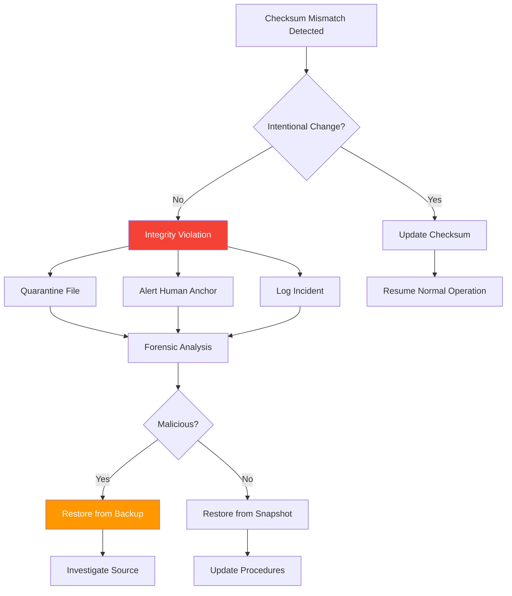

# Vault Integrity: Checksum & Verification

**Vault Integrity** is the technical subsystem that ensures vault contents remain tamper-free through cryptographic checksums, continuous verification, and automated integrity monitoring.

## Overview

Vault Integrity provides the cryptographic foundation for trust in vault-backed systems. Every file is checksummed, verified, and monitored to detect any unauthorized modifications.

**Core Philosophy:** Trust, but verify. Continuously.

---

## Status

| Attribute | Value |
|-----------|-------|
| **Version** | Production v1.0.0 |
| **Status** | ✅ Stable and Ready |
| **Algorithm** | SHA-256 (default) |
| **License** | MIT (Open Source) |

---

## Key Concepts

### Cryptographic Checksums

Every file has a unique fingerprint:

**SHA-256 Example:**

```bash
# Input file
echo "Hello, MirrorDNA!" > test.txt

# Generate checksum
sha256sum test.txt
# Output: 8f8d7e3b6c4a5e2f1d9c8b7a6f5e4d3c2b1a9f8e7d6c5b4a3f2e1d0c9b8a7f6e

# Modify file
echo "Hello, Modified!" > test.txt

# Checksum changes
sha256sum test.txt
# Output: 1a2b3c4d5e6f7a8b9c0d1e2f3a4b5c6d7e8f9a0b1c2d3e4f5a6b7c8d9e0f1a2b
```

**Property:** Even a single character change produces a completely different checksum.

---

### Tamper Detection

Checksums detect any modification:

```yaml
tamper_detection:
  file: "notes/important-document.md"

  stored_checksum: "8f8d7e3b6c4a5e2f..."
  calculated_checksum: "1a2b3c4d5e6f7a8b..."

  status: "TAMPERED"
  action: "ALERT"
  alert_sent: "2025-01-15T10:05:00Z"
```

**Detection Guarantees:**

- **Addition:** New content detected
- **Deletion:** Removed content detected
- **Modification:** Changed content detected
- **Reordering:** Position changes detected

---

### Integrity Database

Store checksums in SQLite database:

```sql
-- .vault-integrity/checksums.db

CREATE TABLE checksums (
  file_path TEXT PRIMARY KEY,
  checksum_sha256 TEXT NOT NULL,
  file_size INTEGER NOT NULL,
  modified_time TEXT NOT NULL,
  verified_time TEXT,
  status TEXT DEFAULT 'unverified'
);

CREATE INDEX idx_status ON checksums(status);
CREATE INDEX idx_verified_time ON checksums(verified_time);
```

**Example Records:**

| file_path | checksum_sha256 | file_size | modified_time | verified_time | status |
|-----------|----------------|-----------|---------------|---------------|--------|
| notes/reflection.md | 8f8d7e3b... | 4526 | 2025-01-15T10:00 | 2025-01-15T10:01 | verified |
| config/settings.yaml | 1a2b3c4d... | 892 | 2025-01-15T09:00 | 2025-01-15T10:01 | verified |
| artifacts/report.md | 9e8d7c6b... | 12450 | 2025-01-15T08:00 | 2025-01-15T10:01 | verified |

---

## Checksum Operations

### Generate Checksums

Create checksums for all vault files:

```bash
# Using checksum_verifier.py
python tools/checksum_verifier.py --generate ~/my-vault

# Output:
# Generating checksums for 557 files...
# ✅ notes/reflection.md: 8f8d7e3b6c4a5e2f...
# ✅ config/settings.yaml: 1a2b3c4d5e6f7a8b...
# ✅ artifacts/report.md: 9e8d7c6b5a4e3d2c...
# ...
# ✅ 557 checksums generated
# ✅ Database updated: .vault-integrity/checksums.db
```

**What It Does:**

1. Recursively scan vault directory
2. Calculate SHA-256 for each file
3. Store in integrity database
4. Update `verified_time` timestamp

---

### Verify Checksums

Check integrity of vault files:

```bash
# Verify all files
python tools/checksum_verifier.py --verify ~/my-vault

# Output:
# Verifying 557 files...
# ✅ notes/reflection.md (intact)
# ✅ config/settings.yaml (intact)
# ⚠️ artifacts/report.md (MODIFIED)
# ✅ agents/agentdna.yaml (intact)
# ...
#
# Summary:
# ✅ 556 files intact (99.8%)
# ⚠️ 1 file modified
# ❌ 0 files corrupted
```

**Verification Process:**

1. Read stored checksum from database
2. Calculate current checksum from file
3. Compare stored vs. current
4. Report status (intact, modified, or missing)

---

### Update Checksums

Update checksums after intentional changes:

```bash
# Update checksums for modified files
python tools/checksum_verifier.py --update ~/my-vault

# Output:
# Checking for modified files...
# 📝 artifacts/report.md has changed
#    Old checksum: 9e8d7c6b5a4e3d2c...
#    New checksum: 3f2e1d0c9b8a7f6e...
#    Update? [y/N] y
#
# ✅ Checksum updated for artifacts/report.md
# ✅ Database updated
```

**Use Case:** After you intentionally edit a file, update its checksum so it's not flagged as "modified" next time.

---

### Selective Verification

Verify specific files or patterns:

```bash
# Verify single file
python tools/checksum_verifier.py --verify ~/my-vault/notes/reflection.md

# Verify by pattern
python tools/checksum_verifier.py --verify ~/my-vault --pattern "*.yaml"

# Verify specific folder
python tools/checksum_verifier.py --verify ~/my-vault/01_AGENTS/
```

---

## Checksum Algorithms

### SHA-256 (Default)

**Properties:**

- **Hash size:** 256 bits (64 hex characters)
- **Security:** Cryptographically secure
- **Performance:** ~500 MB/s on modern CPUs
- **Collision resistance:** Practically impossible to find two different files with same hash

**Example:**

```bash
sha256sum file.md
# Output: 8f8d7e3b6c4a5e2f1d9c8b7a6f5e4d3c2b1a9f8e7d6c5b4a3f2e1d0c9b8a7f6e
```

---

### SHA-512 (High Security)

**Properties:**

- **Hash size:** 512 bits (128 hex characters)
- **Security:** More secure than SHA-256
- **Performance:** ~400 MB/s (slightly slower)
- **Use case:** High-security environments

**Configuration:**

```yaml
vault_integrity:
  checksum_algorithm: "sha512"
```

---

### BLAKE3 (High Performance)

**Properties:**

- **Hash size:** 256 bits (configurable)
- **Security:** Modern, cryptographically secure
- **Performance:** ~3 GB/s (much faster than SHA-256)
- **Use case:** Large vaults, frequent verification

**Configuration:**

```yaml
vault_integrity:
  checksum_algorithm: "blake3"
```

**Status:** 🚧 Beta support (Q2 2025)

---

### Algorithm Comparison

| Algorithm | Security | Speed | Size | Status |
|-----------|----------|-------|------|--------|
| **SHA-256** | ✅ Strong | Medium | 64 hex | ✅ Production (default) |
| **SHA-512** | ✅ Stronger | Slower | 128 hex | ✅ Production |
| **BLAKE3** | ✅ Strong | Fast | 64 hex | 🚧 Beta |
| **MD5** | ❌ Weak | Fast | 32 hex | ⚠️ Legacy only (not recommended) |

**Recommendation:** Use SHA-256 for most cases. Use BLAKE3 if speed is critical.

---

## Continuous Monitoring

### Real-Time Verification

Monitor vault integrity continuously:

```yaml
continuous_monitoring:
  enabled: true
  interval: "5_minutes"

  actions:
    file_modified:
      - log_event
      - calculate_new_checksum
      - alert_if_unexpected

    file_added:
      - log_event
      - generate_checksum

    file_deleted:
      - log_event
      - alert_critical

  alerts:
    email: "admin@example.com"
    slack: "#vault-integrity"
    desktop_notification: true
```

---

### Scheduled Verification

Run periodic integrity checks:

```bash
# Cron job example (daily at 2 AM)
0 2 * * * /usr/local/bin/vault-integrity verify /path/to/vault --report email

# Cron job example (hourly)
0 * * * * /usr/local/bin/vault-integrity verify /path/to/vault --quiet
```

---

### Integrity Dashboard

Real-time monitoring interface:

```yaml
integrity_dashboard:
  vault: "~/my-vault"

  metrics:
    total_files: 557
    verified_files: 556
    integrity_score: 99.8%
    last_verification: "2025-01-15T10:01:00Z"

  alerts:
    - severity: "warning"
      file: "artifacts/report.md"
      message: "File modified since last verification"
      timestamp: "2025-01-15T10:00:00Z"

  actions:
    - update_checksum
    - quarantine_file
    - review_changes
```

---

## Integration with Glyphtrail

Vault Integrity works with Glyphtrail for lineage:

```yaml
integrity_with_lineage:
  file: "notes/reflection.md"

  integrity:
    checksum_current: "8f8d7e3b..."
    checksum_verified: "8f8d7e3b..."
    status: "intact"

  glyphtrail:
    predecessor: "notes/reflection.md@v1"
    successor: null
    glyphsig: "⟡⟦CONTINUITY⟧ · ⟡⟦SESSION⟧"
    vault_id: "AMOS://User/Jane/v1.0"

  combined_verification:
    integrity: "✅ Checksum valid"
    lineage: "✅ Predecessor chain intact"
    overall: "✅ VERIFIED"
```

[:octicons-arrow-right-24: Learn about Glyphtrail](glyphtrail.md)

---

## Use Cases

### Personal Vault

Individual user protecting notes:

```yaml
personal_vault_integrity:
  vault_path: "~/Obsidian/MirrorDNA"

  verification:
    frequency: "daily"
    automated: true

  alerts:
    email: "user@example.com"
    critical_only: true

  backup_on_failure: true
```

---

### Team Vault

Collaborative vault with multiple contributors:

```yaml
team_vault_integrity:
  vault_path: "~/Projects/TeamVault"

  verification:
    frequency: "hourly"
    automated: true

  change_tracking:
    log_all_modifications: true
    attribute_changes_to_user: true
    require_commit_message: true

  alerts:
    slack: "#team-vault"
    severity_threshold: "warning"
```

---

### Compliance Vault

Regulatory environment requiring audit trails:

```yaml
compliance_vault_integrity:
  vault_path: "/mnt/compliance/vault"

  verification:
    frequency: "continuous"
    algorithm: "sha512"  # Higher security

  audit_trail:
    retention: "10_years"
    export_format: "pdf"
    third_party_verification: true

  alerts:
    email: ["compliance@example.com", "ciso@example.com"]
    severity_threshold: "info"  # Alert on everything

  encryption:
    at_rest: true
    in_transit: true
```

---

## Integrity Violation Response

### Workflow

When checksum mismatch detected:



---

### Incident Report

Automatically generated on violation:

```yaml
integrity_incident_report:
  incident_id: "INC-2025-01-15-001"
  timestamp: "2025-01-15T10:00:00Z"
  severity: "critical"

  affected_file:
    path: "artifacts/report.md"
    checksum_expected: "9e8d7c6b5a4e3d2c..."
    checksum_actual: "3f2e1d0c9b8a7f6e..."

  detection:
    method: "scheduled_verification"
    detected_by: "vault-integrity v1.0.0"

  response:
    - action: "quarantine_file"
      timestamp: "2025-01-15T10:00:01Z"
    - action: "alert_sent"
      recipients: ["admin@example.com"]
      timestamp: "2025-01-15T10:00:02Z"
    - action: "snapshot_created"
      snapshot_id: "snap-pre-incident-001"
      timestamp: "2025-01-15T10:00:03Z"

  resolution:
    status: "pending_human_review"
    assigned_to: "Jane Doe"
```

---

## Best Practices

### For All Users

1. **Generate checksums immediately:** After vault creation
2. **Verify regularly:** At least daily for active vaults
3. **Update after changes:** Don't leave files flagged as "modified"
4. **Monitor alerts:** Don't ignore integrity warnings
5. **Backup before updates:** Snapshot before bulk changes

---

### For Organizations

1. **Continuous monitoring:** Real-time verification for critical vaults
2. **Automated response:** Quarantine on integrity violation
3. **Audit trail export:** Monthly compliance reports
4. **Third-party verification:** Annual independent audit
5. **Incident response plan:** Document procedures

---

### For High-Security Environments

1. **Use SHA-512:** Higher security than SHA-256
2. **Encrypt checksums:** Protect integrity database
3. **Hardware security modules:** Store critical checksums in HSM
4. **Immutable storage:** Write-once checksums
5. **Blockchain anchoring:** Optional external verification

---

## Performance

### Benchmarks

**SHA-256 Performance** (modern CPU):

| Vault Size | File Count | Generation Time | Verification Time |
|------------|------------|----------------|-------------------|
| 10 MB | 100 files | 0.5 seconds | 0.5 seconds |
| 100 MB | 1,000 files | 2 seconds | 2 seconds |
| 1 GB | 10,000 files | 15 seconds | 15 seconds |
| 10 GB | 100,000 files | 2.5 minutes | 2.5 minutes |

**Factors Affecting Performance:**

- **CPU speed:** Faster CPU = faster checksums
- **Disk I/O:** SSD much faster than HDD
- **File size distribution:** Many small files slower than few large files
- **Parallelization:** Multi-core CPUs can verify multiple files simultaneously

---

### Optimization

Speed up verification:

```yaml
performance_optimization:
  parallel_verification: true
  max_threads: 8

  skip_large_files: false
  skip_threshold: "1GB"  # Optional: skip files > 1GB

  incremental_verification: true  # Only verify changed files

  cache_results: true
  cache_duration: "1_hour"
```

---

## Tools

### checksum_verifier.py

Command-line tool:

```bash
# Generate checksums
python tools/checksum_verifier.py --generate /path/to/vault

# Verify checksums
python tools/checksum_verifier.py --verify /path/to/vault

# Update checksums
python tools/checksum_verifier.py --update /path/to/vault

# Export checksums
python tools/checksum_verifier.py --export /path/to/vault --format csv
```

---

### Vault Integrity Monitor (GUI)

Desktop application (future):

**Features:**

- Real-time integrity dashboard
- Visual vault browser with integrity status
- One-click verification
- Alert configuration
- Incident history

**Status:** Planned Q3 2025

---

## Roadmap

### v1.0.0 (Current)

- ✅ SHA-256 checksum generation
- ✅ Verification and update
- ✅ SQLite integrity database
- ✅ Command-line tools

### v1.5.0 (Q2 2025)

- BLAKE3 support (high performance)
- Parallel verification (multi-threaded)
- Incremental verification (changed files only)
- Web-based dashboard

### v2.0.0 (Q3 2025)

- Real-time monitoring (continuous)
- Automated quarantine on violation
- Hardware security module (HSM) integration
- Blockchain anchoring (optional)

### v2.5.0 (Q4 2025+)

- Quantum-resistant hash functions
- Distributed integrity verification
- AI-powered anomaly detection
- Network consensus protocols

---

## Related Documentation

- **[Vault Manager](vault-manager.md)** — Vault orchestration
- **[Glyphtrail](glyphtrail.md)** — Lineage tracking
- **[ActiveMirrorOS](activemirroros.md)** — Integrity dashboard
- **[Trust-by-Design](trust-by-design.md)** — Governance framework
- **[MirrorDNA Standard](mirrordna-standard.md)** — Protocol foundation

---

⟡⟦INTEGRITY⟧ · ⟡⟦VERIFIED⟧ · ⟡⟦TAMPER-EVIDENT⟧

*Trust, but verify. Continuously.*
